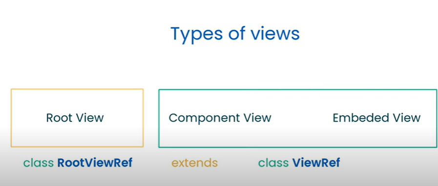

### What is Change Detection ?

It is a process to synchronize the model/state changes to the view.
There are Two types of change detection.

- `Default Change detection`: It checks for changes in all components and their templates on every change detection cycle.

  How It Works:

  `Change Detection`

  &#8595;

  `Process 1`: View Checking(Synchronization of the component view with the data model).

  &#8595;&#8593;

  `Process2` Re-run Process1(Automatically re-execute the view checking when application state might changed).

  Second Process(`Process2`) can be disabled in main.ts file

  ```
  import { platformBrowserDynamic } from '@angular/platform-browser-dynamic';
  import { AppModule } from './app/app.module';

  platformBrowserDynamic().bootstrapModule(AppModule, { ngZone: 'noop' })
  .catch(err => console.error(err));

  ```

  so Here by using `ngZone: 'noop'`, it stops automatically re-execution of view checking.

  

### What is Zone.Js

Zone.js is a library that shipped with angular. `Zone` creates a wrapper around all asynchronous operations in the browser such as user interactions,setTimeOut, setInterval, Promise and any other changes that can cause `changes in state`, If it's find the changes in state then angular run the change detection from top to down view tree.

- But How exactly zonejs notify to angular of async operation completion, So Zone.js use the technique called monkey patching to patch the browser's native APi and bring some additional behaviour to it.

`Note:` Zone js doesn't know that from which component state has changed and only it knows that some state from some component has been changed and it informs to angular to start the change detection, then angular starts checking from whole view tree from top-to-bottom, that the main issue with zonejs.

This problem can be solved by onPush strategy but the real solution would be solved by `Signal`(introduced in Angular 16).

TODO: // Create the app without zone and hanle the manually change detection
