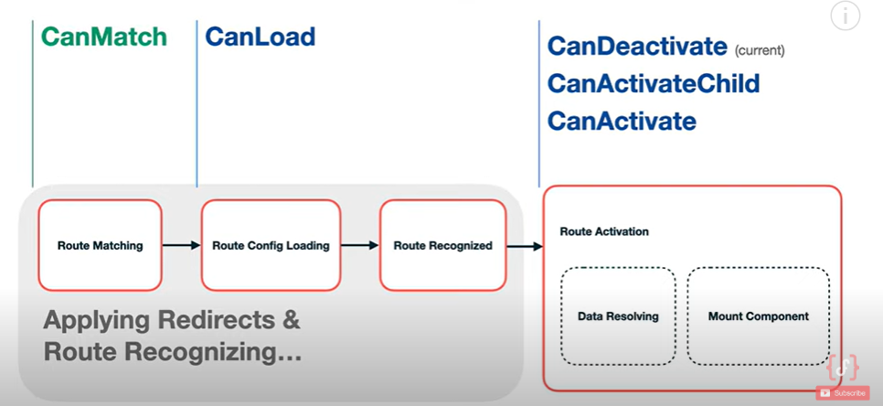

### Route Guards

Route guards are servies that we can use to control navigation to and form routes from the applications.

`Note`: Router guards as `functions` were introduced in Angular `15`. In below example used prior angular 15 syntax.In canMatch guard i have used latest syntax, same syantax will apply for canActivate, CanDeactivate and so on....

`Types of Route Guards`

- CanActivate
- CanDeactivate
- Resolve
- CanLoad
- CanActivateChild
- CanMatch

\*\* `CanActivate`: The `CanActivate` guard is used to check whether a route can be activated(or the component gets rendered).This is commonly used for authentication and authorization checks.

```
auth.guard.ts

import { Injectable } from '@angular/core';
import { CanActivate, Router } from '@angular/router';
import { AuthService } from './auth.service';

@Injectable({
  providedIn: 'root'
})
export class AuthGuard implements CanActivate {
  constructor(private authService: AuthService, private router: Router) {}

  canActivate(): boolean {
    if (this.authService.isLoggedIn()) {
      return true;
    } else {
      this.router.navigate(['/login']);
      return false;
    }
  }
}

```

app-routing.module.ts:

```
import { NgModule } from '@angular/core';
import { RouterModule, Routes } from '@angular/router';
import { AuthGuard } from './auth.guard';
import { ProtectedComponent } from './protected/protected.component';
import { LoginComponent } from './login/login.component';

const routes: Routes = [
  { path: 'protected', component: ProtectedComponent, canActivate: [AuthGuard] },
  { path: 'login', component: LoginComponent },
  { path: '', redirectTo: '/login', pathMatch: 'full' }
];

@NgModule({
  imports: [RouterModule.forRoot(routes)],
  exports: [RouterModule]
})
export class AppRoutingModule {}

```

\*\* `CanDeactivate`: The `CanDeactivate` guard is used to prevent a user from `accidentally` leaving a route where `unsaved` changes might be lost.

\*\* `Resolve`: The Resolve guard is used to `pre-fetch` data `before` navigating to a route.

data-resolver.service.ts:

```
import { Injectable } from '@angular/core';
import { Resolve } from '@angular/router';
import { Observable, of } from 'rxjs';

@Injectable({
  providedIn: 'root'
})
export class DataResolverService implements Resolve<Observable<string>> {
  resolve(): Observable<string> {
    return of('Resolved Data');
  }
}

```

resolved.component.ts:

```
import { Component, OnInit } from '@angular/core';
import { ActivatedRoute } from '@angular/router';

@Component({
  selector: 'app-resolved',
  template: `<p>{{ data }}</p>`
})
export class ResolvedComponent implements OnInit {
  data: string;

  constructor(private route: ActivatedRoute) {}

  ngOnInit() {
    this.route.data.subscribe(data => {
      this.data = data['resolvedData'];
    });
  }
}

```

app-routing.module.ts:

```
import { NgModule } from '@angular/core';
import { RouterModule, Routes } from '@angular/router';
import { DataResolverService } from './data-resolver.service';
import { ResolvedComponent } from './resolved/resolved.component';

const routes: Routes = [
  {
    path: 'resolved',
    component: ResolvedComponent,
    resolve: { resolvedData: DataResolverService }
  },
  { path: 'login', component: LoginComponent },
  { path: '', redirectTo: '/login', pathMatch: 'full' }
];

@NgModule({
  imports: [RouterModule.forRoot(routes)],
  exports: [RouterModule]
})
export class AppRoutingModule {}

```

\*\* `CanLoad`: The `CanLoad` guard is used to decide if a module can be loaded. This is typically used to implement lazyloaded module.

auth-load.guard.ts:

```
import { Injectable } from '@angular/core';
import { CanLoad, Route, Router } from '@angular/router';
import { AuthService } from './auth.service';

@Injectable({
  providedIn: 'root'
})
export class AuthLoadGuard implements CanLoad {
  constructor(private authService: AuthService, private router: Router) {}

  canLoad(route: Route): boolean {
    if (this.authService.isLoggedIn()) {
      return true;
    } else {
      this.router.navigate(['/login']);
      return false;
    }
  }
}

```

app-routing.module.ts:

```
import { NgModule } from '@angular/core';
import { RouterModule, Routes } from '@angular/router';
import { AuthLoadGuard } from './auth-load.guard';

const routes: Routes = [
  {
    path: 'admin',
    loadChildren: () => import('./admin/admin.module').then(m => m.AdminModule),
    canLoad: [AuthLoadGuard]
  },
  { path: 'login', component: LoginComponent },
  { path: '', redirectTo: '/login', pathMatch: 'full' }
];

@NgModule({
  imports: [RouterModule.forRoot(routes)],
  exports: [RouterModule]
})
export class AppRoutingModule {}

```

`Note`: `canLoad` guard is deprecated in angular `15.1` version, in favor of the `CanMatch` guard.

\*\* `CanActivateChild`: `CanActivateChild` guard determines whether a `child route` can be activated. This guard is very similar to CanActivateGuard. We `apply` this guard to the `parent route`.

```
import { NgModule } from '@angular/core';
import { RouterModule, Routes } from '@angular/router';
import { AuthChildGuard } from './auth-child.guard';
import { ParentComponent } from './parent/parent.component';
import { ChildComponent } from './child/child.component';

const routes: Routes = [
  { path: 'parent', component: ParentComponent, canActivateChild: [AuthChildGuard], children: [
    { path: 'child', component: ChildComponent }
  ]},
  { path: 'login', component: LoginComponent },
  { path: '', redirectTo: '/login', pathMatch: 'full' }
];

@NgModule({
  imports: [RouterModule.forRoot(routes)],
  exports: [RouterModule]
})
export class AppRoutingModule {}

```

\*\* `CanMatch`: This guard came in angular 15.

- `canMatch` guard is replacement for `canLoad`.

- There is drawback in `canLoad`, It can prevents navigation if module is `lazy loaded` but in case of `standalone` component, it doesn't prevent the path.

- `canMatch` guard can be useful when two route path is same and loading component is different

```
  {
    path: 'home',
    loadComponent: () => import('./app-template/app-template.component').then((c) => c.AppTemplateComponent),
    canLoad: [canMatchGuard], // Here it will load the component, even if the return value is false and this can be handle via canMatch, so it doesn't allow to move to HomeComponent if return value is false.

    title: 'home'
  },
```

When moving to any router we first need the `target`(example: {path: 'dashboard'(`target`)}) router config, and url is matches with it then it loads the view

