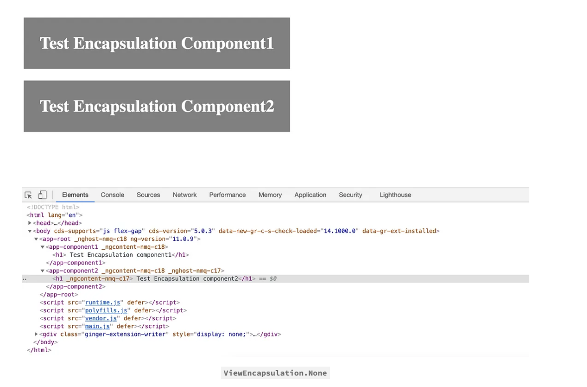
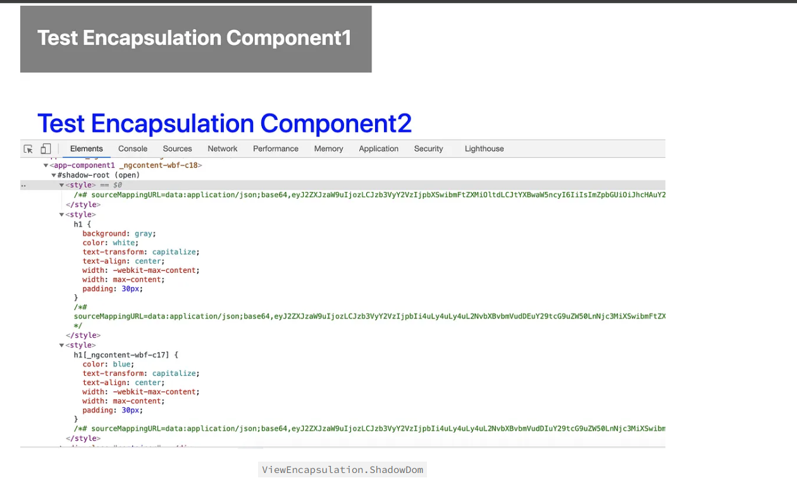

### View Encapsulation in Angular

`view encapsulation` refers to mechanism of ensuring that the style defined for a component do not affect the rest of the application.

To understand `ViewEncapsulation` in Angular, first, we should understand the Shadow DOM. Simply put, the Shadow DOM brings Encapsulation to HTML Elements. Using the Shadow DOM, markup, styles, and behaviors are scoped to the element and do not clash with other nodes of the DOM.

The following three strategies are provided by Angular to determine how styles are applied.

- ViewEncapsulation.None
- ViewEncapsulation.Emulated(default)
- ViewEncapsulation.ShadowDOM

- `ViewEncapsulation.None`: It means Styles defined in the component's are applied globally to all components and elements in the application.

  - There is no shadow dom
  - Style is not scope to the component.

- `ViewEncapsulation.Emulated(default)`:

  - Angular will not create a Shadow DOM for the component.
  - The style will be scoped to the component.

- `ViewEncapsulation.ShadowDOM`:
  - Angular will create Shadow DOM for the component.
  - Style is scoped to the component.

Now, if we look at the application h1 changes will be applied to component1 only. The angular renders the component inside the #shadow root element. The styles from the component along with the styles from the parent and other components are also injected inside the shadow root

### ViewEncapsulation ShadowDom vs Emulated

Emulated will add the css style in the head section of your website(and reference your component's unique id(\_ngcontent) to apply it).

ViewEncapsulation.ShadowDom will add the css style inside the generated DOM of your component.
