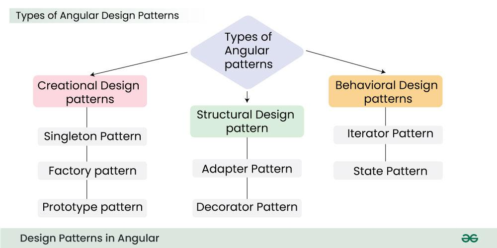

# Angular Design Patterns



## 1. Creational Design Patterns

- **Singleton Pattern**:

  **Purpose:** Ensures only one instance of a class exists in the application.

  **Use Case**: Logging, caching, database connections.

  ```ts
  @Injectable({ providedIn: 'root' }) // Singleton in Angular
  export class LoggerService {
    logs: string[] = [];

    log(message: string) {
      this.logs.push(message);
    }
  }
  ```

  **Using normal class approach**

  ```ts
  class SingletonService {
    private static instance: SingletonService;

    private constructor() {
      // Private constructor to prevent instantiation.
    }

    public static getInstance(): SingletonService {
      if (!SingletonService.instance) {
        SingletonService.instance = new SingletonService();
      }
      return SingletonService.instance;
    }
  }

  const singletonInstance = SingletonService.getInstance();
  ```

  **Why Use It?**

  - Centralizes state (e.g., authentication status).
  - Prevents multiple instances from consuming extra memory.

- **(2) Factory Pattern:**

  **Purpose:** Creates objects without exposing instantiation logic.

  **Use Case:** Dynamic component creation, logger types (file/console).

  ```ts
  interface Logger {
    log(message: string): void;
  }

  class ConsoleLogger implements Logger {
    log(message: string): void {
      console.log(message);
    }
  }

  class FileLogger implements Logger {
    log(message: string): void {
      // Log to a file.
    }
  }

  // Factory method
  function createLogger(type: 'console' | 'file'): Logger {
    if (type === 'console') {
      return new ConsoleLogger();
    } else if (type === 'file') {
      return new FileLogger();
    }
  }

  const consoleLogger = createLogger('console');
  consoleLogger.log('Logging to console');
  ```

  **Why Use It?**

  - Decouples object creation from usage.
  - Easy to extend (e.g., add a DatabaseLogger later).

- **(3) Prototype Pattern**:

  **Purpose:** Clones objects instead of re-creating them.

  **Use Case:** Costly object initialization (e.g., complex configurations).

  ```ts
  interface Prototype {
    clone(): Prototype;
  }

  class ConcretePrototype implements Prototype {
    private property: string;

    constructor(property: string) {
      this.property = property;
    }

    clone(): Prototype {
      return new ConcretePrototype(this.property);
    }
  }

  const originalObject = new ConcretePrototype('Original');
  const clonedObject = originalObject.clone();
  ```

  **Why Use It?**

  - Saves resources when duplicating objects.
  - Preserves original state.

## 2. Structural Design Patterns

- **(1) Adapter Pattern:**

  **Purpose:** Makes incompatible interfaces work together.

  **Use Case:** Integrating third-party libraries.

  ```ts
  interface NewLogger {
    logMessage(message: string): void;
  }

  class OldLogger {
    log(msg: string): void {
      console.log(msg);
    }
  }

  class Adapter implements NewLogger {
    private oldLogger: OldLogger;

    constructor(oldLogger: OldLogger) {
      this.oldLogger = oldLogger;
    }

    logMessage(message: string): void {
      this.oldLogger.log(message);
    }
  }

  const oldLogger = new OldLogger();
  const loggerAdapter = new Adapter(oldLogger);
  loggerAdapter.logMessage('Logging with adapter');
  ```

  **Why Use It?**

  - Bridges gaps between old and new systems.
  - No need to rewrite existing code.

- **(2) Decorator Pattern:**

  **Purpose:** Adds new behaviors to objects dynamically.

  **Use Case:** Feature toggles, UI enhancements.

  ```ts
  interface Coffee {
    cost(): number;
  }

  class SimpleCoffee implements Coffee {
    cost(): number {
      return 5;
    }
  }

  class MilkDecorator implements Coffee {
    private coffee: Coffee;

    constructor(coffee: Coffee) {
      this.coffee = coffee;
    }

    cost(): number {
      return this.coffee.cost() + 2;
    }
  }

  class SugarDecorator implements Coffee {
    private coffee: Coffee;

    constructor(coffee: Coffee) {
      this.coffee = coffee;
    }

    cost(): number {
      return this.coffee.cost() + 1;
    }
  }

  const myCoffee = new SugarDecorator(new MilkDecorator(new SimpleCoffee()));
  console.log(myCoffee.cost()); // Output: 8
  ```

  **Why Use It?**

  - Extends functionality without modifying original class.
  - Used in Angular directives (@Directive).

## 3. Behavioral Design Patterns

- **(1) Iterator Pattern**

  **Purpose:** Traverses collections without exposing internal structure.

  **Use Case:** Pagination, custom data loops.

  ```ts
  interface Iterator<T> {
    next(): T;
    hasNext(): boolean;
  }

  class ConcreteIterator<T> implements Iterator<T> {
    private collection: T[];
    private index: number = 0;

    constructor(collection: T[]) {
      this.collection = collection;
    }

    next(): T {
      return this.collection[this.index++];
    }

    hasNext(): boolean {
      return this.index < this.collection.length;
    }
  }

  const iterableCollection = [1, 2, 3, 4, 5];
  const iterator = new ConcreteIterator(iterableCollection);

  while (iterator.hasNext()) {
    console.log(iterator.next());
  }
  ```

  **Why Use It?**

  - Unified way to access different data structures (arrays, trees).

- **(2) State Pattern**

  **Purpose:** Changes object behavior based on state.

  **Use Case:** UI states (loading/success/error), workflows.

  ```ts
  interface State {
    handleRequest(): void;
  }

  class ConcreteStateA implements State {
    handleRequest(): void {
      console.log('Handling request in State A');
    }
  }

  class ConcreteStateB implements State {
    handleRequest(): void {
      console.log('Handling request in State B');
    }
  }

  class Context {
    private state: State;

    constructor(state: State) {
      this.state = state;
    }

    setState(state: State): void {
      this.state = state;
    }

    request(): void {
      this.state.handleRequest();
    }
  }

  const context = new Context(new ConcreteStateA());
  context.request(); // Output: Handling request in State A
  context.setState(new ConcreteStateB());
  context.request(); // Output: Handling request in State B
  ```

  **Why Use It?**

  - Clean state management (alternative to NgRx for simple cases).

Reference: https://www.geeksforgeeks.org/system-design/design-patterns-in-angular/
