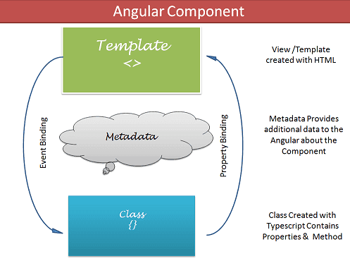
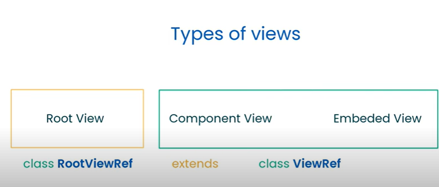

### Angular 14 Changes

#### `Standalone components, directives, and pipes:`

A component which is not a part of any module that is known as standalone components.

`It can be used with`

- Other standalone components
- Module-based components
- Loading routes
- Lazy loading

`Note:` Any standalone components doesn't require to be part of any module, if it's declare then angular complains about by throwing an error.

`Migrate existing components to standalone`:

- set standalone property to `true`.
- Remove it from `declaration` array of the module of which it was a part.
- use `imports` array to add `dependency`.

Example:


For more details [click here](https://www.telerik.com/blogs/angular-14-introducing-standalone-components)

### `Typed Angular Forms`

Before `angular 14` angular `Reactive Form` was not fully type safe, meaning that the value emmited by formControl is type of `any`.

Now from `angular` 14 and moving forward angular has added full built-in type safety to `Reactive Forms`, meaning that you can get useful error messages and auto-completion when working with form values, when patching form values, and in many other situations.
Example:

```ts
form = this.fb.group({
  email: [
    '',
    {
      validators: [Validators.required, Validators.email]
    }
  ],
  password: ['', [Validators.required, Validators.minLength(8)]]
});
```



`Avoid This Common Typed Forms Pitfall`: Try to avoid declaring form member variable and initializing it on `ngOnInit`, it prevents you from benefitting from full type safety.

It's not working because of we are declaring the form as of type FormGroup, which implicitly defaults to FormGroup<'any'>.
For more details of typed form [click here](https://blog.angular-university.io/angular-typed-forms/)

### `Streamlined page title accessibility`

we can add the router title without any additional import on the page. Refer to the following code example.

```ts
const routes: Routes = [{
  path: 'home',
  component: HomeComponent
}, {
  path: 'about',
  component: AboutComponent,
  title: 'About Me'  // <-- Page title
}];

@Injectable()
export class TemplatePageTitleStrategy extends TitleStrategy {
  override updateTitle(routerState: RouterStateSnapshot) {
    const title = this.buildTitle(routerState);
    if (title !== undefined) {
      document.title = `My App - ${title}`;
    } else {
      document.title = `My App - Home`;
  };
};

@NgModule({
  …
  providers: [{provide: TitleStrategy,  useClass: TemplatePageTitleStrategy}]
})
class MainModule {}
```

### `Extended developer diagnostics`

New [extended diagnostics](https://angular.io/extended-diagnostics) provide an extendable framework that gives more insight into templates and how you might be able to improve them. Diagnostics give compile-time warnings with precise, actionable suggestions for your templates, catching bugs before run-time.

### `More built-in improvements`

Angular 14 also includes support for the latest TypeScript 4.7 release and now targets ES2020 by default, which allows the CLI to ship smaller code without paring down features.

### `Bind to protected component members`

Now we can bind `protected` component members directly from the template. Refer to the following code example.

```ts
@Component({
  selector: 'app-root',
  template: '{{ title }}' // Now compiles!
})
export class SampleComponent {
  protected title: string = 'Angular 14';
}
```

### `Optional injectors in embedded Views`

Need to understand more

For more details on angular 14 upgrade [click here](https://blog.angular.io/angular-v14-is-now-available-391a6db736af)
