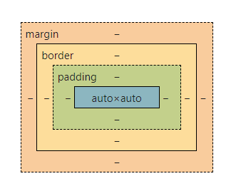
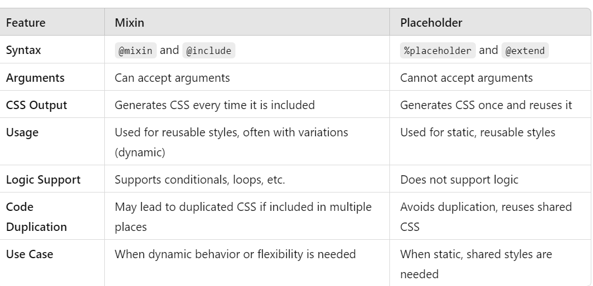

#### What is CSS ?

Ans: CSS stands for Cascading Style Sheets. CSS describes how HTML elements are to be displayed on screen.

#### What is Box model ?

Ans: The box model in CSS is a container that contains various properties, including borders, margins, padding, and the content itself.



#### What are different type of selector in CSS ?

Ans: CSS selectors into five categories:

- `Simple selectors` (select elements based on name, id, class).
- `Combinators selectors:`
  There are four different combinators in CSS:
  - `descendant selector (space)`
  - `child selector (>)`
  - `adjacent sibling selector (+)`
  - `general sibling selector (~)`
- `Pseudo-class selectors `: (select elements based on a certain state)
- `Pseudo-elements selectors`: (select and style a part of an element).
- `Attribute selectors`: (select elements based on an attribute or attribute value).

#### What do you understand by the universal sector ?

Ans: The universal selector `(*)` selects all HTML elements on the page.

```css
* {
  text-align: center;
  color: blue;
}
```

#### Define z-index ?

Ans: It defines the stack of the element.
`Note:` z-index only works on positioned elements (position: absolute, position: relative, position: fixed, or position: sticky) and flex items.

#### What is a CSS Preprocessor ?

Ans: A CSS preprocessor is a scripting language that **extends CSS** with powerful features and is compiled into regular CSS syntax.

**Key Features & Benefits**

- **Variables (Reusable Values)**:

```scss
// Sass
$primary-color: #3498db;
$spacing-unit: 16px;

.button {
  background: $primary-color;
  padding: $spacing-unit;
}
```

- **2. Nesting (Hierarchical Structure)**

```scss
// Sass
nav {
  ul {
    margin: 0;
    li {
      display: inline-block;
    }
  }
}
```

- **3. Mixins (Reusable Code Blocks)**

```scss
// Sass
@mixin flex-center {
  display: flex;
  justify-content: center;
  align-items: center;
}

.header {
  @include flex-center;
  height: 100vh;
}
```

- **4. Functions & Operations**

```scss
// Sass
@function double($n) {
  @return $n * 2;
}

.container {
  padding: double(16px); // 32px
}
```

- **5. Partials & Imports (Modular CSS)**

```scss
// _variables.scss (Partial file)
$font-stack: Helvetica, sans-serif;

// main.scss
@import 'variables';
body {
  font-family: $font-stack;
}
```

#### What are CSS Sprites and what are the benefits of it.

Ans: An image sprite is a collection of images put into a single image. Using image sprites will reduce the number of server requests and save bandwidth.

#### What are Pseudo-classes?

Ans: A pseudo-class is used to define a special state of an element.
Example: :hover, :active etc

#### what is sudo element ?

Pseudo-elements allow you to style certain parts of an element's content or layout.
Some common pseudo-elements include ::before, ::after, ::first-line, and ::first-letter.

#### Explain positioning in css ?

Ans: https://www.freecodecamp.org/news/learn-the-basics-the-css-position-property/

#### Tell us about the property used for image scroll controlling?

Ans: The background-attachment property is used to specify that the background image is fixed or scroll with the rest of the page in the browser window.

This property has three values scroll, fixed, and local. Its default value is scroll, which causes the element to not scroll with its content.

Example:
https://www.w3schools.com/cssref/tryit.php?filename=trycss_background-attachment

#### What is specificity ?

Ans: when multiple selectors target the same element. Then it decides which styles **win** in conflicts.

**How Specificity Works**

**1. Specificity Hierarchy (From Strongest to Weakest)**

| Selector Type                    | Example                           | Specificity Value |
| -------------------------------- | --------------------------------- | ----------------- |
| **Inline styles**                | `style="color:red"`               | `1,0,0,0`         |
| **ID selectors**                 | `#header`                         | `0,1,0,0`         |
| **Class/attribute/pseudo-class** | `.btn`, `[type="text"]`, `:hover` | `0,0,1,0`         |
| **Element/pseudo-element**       | `div`, `::before`                 | `0,0,0,1`         |

**2. Calculation Rules**

- **Count from left to right** (inline → IDs → classes → elements)

- Higher numbers **override** lower ones

- **Equal specificity?** The last rule in the CSS file wins.

#### What is mixin and placeholder ?

Ans: **mixins** and **placeholders** both allow you to write reusable chunks of styles.

