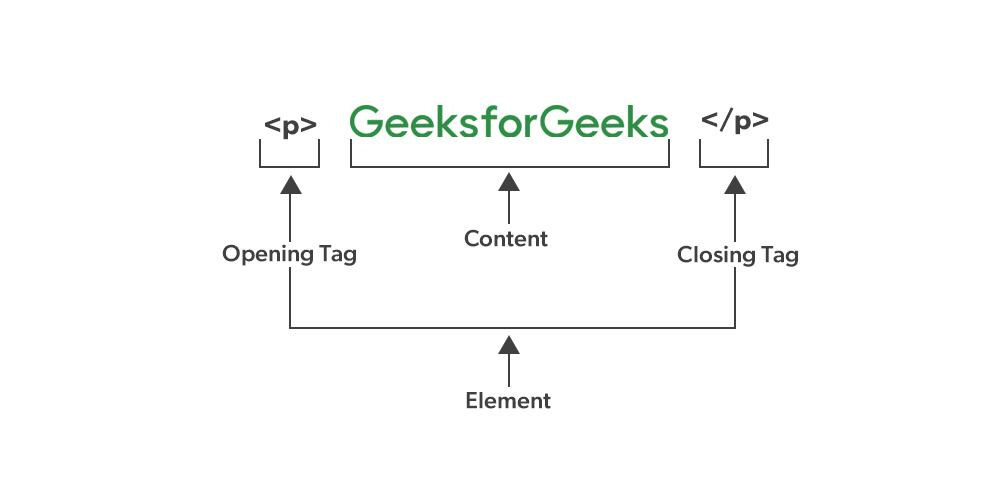

#### What is HTML ?

Ans: HTML (`HyperText Markup Language`) is the standard markup language used to create and structure web pages.

#### What is meta tag ?

Ans: The HTML <meta> tag defines metadata about an HTML document, including character set, description, keywords, author, and viewport settings.

```html
<!DOCTYPE html>
<html>
  <head>
    <!-- meta tag starts -->
    <meta name="keywords" content="Meta Tags, Metadata" />
    <!-- meta tag ends -->
  </head>

  <body>
    <p>Hello!</p>
  </body>
</html>
```

#### What is UTF8

Ans: UTF-8 stands for `Unicode Transformation Format` 8 and is a character encoding standard used for electronic communication.

#### What are new feature of HTML5 ?

- `Audio and Video`
- `Header and Footer`
- `Figure and Figcaption`

```html
<figure>
  
  <figcaption>Fig.1 - Geeksforgeeks.</figcaption>
</figure>
```

- `Nav Tag`:

```html
<nav>
  <a href="/html/">HTML</a>
  <a href="/css/">CSS</a>
  <a href="/js/">JavaScript</a>
  <a href="/jquery/">jQuery</a>
</nav>
```

- `Progress Tag`:

```html
<progress id="file" value="32" max="100">32%</progress>
```

- `form enhancement`:

New input types (email, date, time, url, number, etc.), new attributes (placeholder, autofocus, required, etc.), and new
form elements

```html
<datalist>
  <output
    ><progress>, <meter>improve form handling and user input validation.</meter></progress></output
  >
</datalist>
```

- `Web Storage`: localStorage, sessionStorage

#### What is cache ?

Ans: cache refers to a temporary storage location where data(Javascript, CSS, HTML pages, media (images and videos), etc.) can be stored for faster access in the future . It's a technique used to improve the performance of web applications by reducing the need to fetch data.

#### What is cookies ?

Ans: cookies are small text files(browsing sessions, history of using websites and apps, etc) that websites store on a user's computer to remember information about them.

#### What is SEO ?

Ans: SEO(Search engine optimization) it used for ranking and visibility of website.

There are Some key concept.

- `Title Tag`: The <title> tag is one of the most important HTML elements for SEO.
- `Meta Description`: The <meta> description tag provides a brief summary of the web page's content
- `Heading Tags:` Proper use of heading tags (<h1>, <h2>, <h3>, etc.) helps search engines understand the structure and hierarchy of your content.
- `URL Structure`: URLs should be descriptive and include relevant keywords where appropriate.
- `Alt Text for Images`: The alt attribute in  tags provides alternative text that is displayed if an image fails to load or for accessibility purposes.

#### What is tag and elment ?



#### What is ifram ?

Ans: An inline frame (iframe) is a HTML element that loads another HTML page within the document.

```html
<iframe src="https://www.w3schools.com" title="W3Schools Free Online Web Tutorials"> </iframe>
```

#### What is canvas ?

Ans: The HTML <canvas> element is used to draw graphics, on the fly, via scripting (usually JavaScript).

```html
<canvas id="myCanvas" width="200" height="100" style="border:1px solid #000000;">
  Sorry, your browser does not support canvas.
</canvas>
```

#### What is schementic element ?

Ans: Semantic HTML elements are those that clearly describe their meaning in a human- and machine-readable way.

List of new semantic elements

<article>, <aside>, <details>, <figcaption>, <figure>, <footer>, <header>, <main>, <mark>, <nav>
<section>, <summary>, <time>

#### How do you add CSS styling in HTML ?

Ans: There are three way we can add css

- Inline stlye (not recomended)
- Internal aka embeded css
- External css

#### What hierarchy do the style sheets follow?

Ans: 1: Inline styles, 2: Internal, 3: External

#### What is the difference between “display: none” and “visibility: hidden” when used as attributes to the HTML element?

Ans:
`visibility: hidden` hides the element, but it still takes up space in the layout.

`display: none` removes the element from the document. It does not take up any space.

#### When to use scripts in the head and when to use scripts in the body ?

Ans:
Script in the head tag it load before rendering the page in browser, in this it can delay page parsing.

Script in body it load after the page rendering, it advisible to keep script tag at bottom
