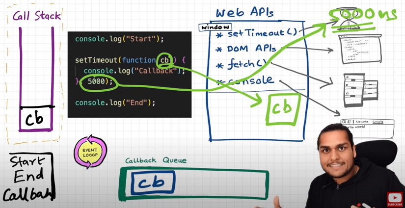
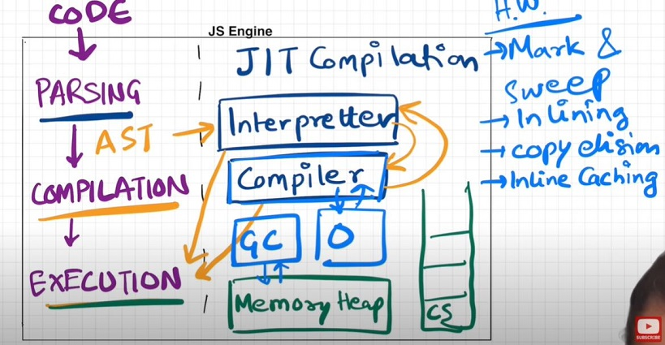

### What is JS?

JS is a synchronous, single-threaded language

- Synchronous:- In a specific synchronous order.
- Single-threaded:- One command at a time.

### What is Execution Context?

### How JS is executed?

### What is Call Stack?

### What is Hoisting?

### What is difference between undefined vs not defined ?

### What is Scope Chain, Scope & Lexical Environment ?

### What is let & const in JS, Temporal Dead Zone?

- `let` & `const` is used do declare the variable and it came in ES6.Whenever we declare the `let` and `const` it is hoisted in different memory called `script`, where it can be access only after assigning some value to it.

`Note`: Accessing `let` and `const` before initilization it could lead the `ReferenceError`.

- `Temporal Dead Zone`: Time since when the `let` or `const` variable was hoisted until it is initialized some value.

`Note`: Attempting to access a variable during its TDZ results in a `ReferenceError`.

```js
console.log(a); // ReferenceError: Cannot access 'a' before initialization
console.log(b); // prints undefined as expected
let a = 10;
console.log(a); // 10
var b = 15;
console.log(window.a); // undefined
console.log(window.b); // 15
```

### What are type of Errors?

Syntax, Reference, and Type.

- `Syntax Error`: Syntax errors occur when there are mistakes in the syntax of code.These errors prevent the code from running.

```js
let a = 10;
let a = 20
// Uncaught SyntaxError: Identifier 'a' has already been declared

if (x === 5 { // Missing closing parenthesis
    console.log('x is 5');
}
// Uncaught SyntaxError: Unexpected token '{'
```

- `Reference Error`: Reference errors occur when try to access a variable or function that has not been declared or is out of scope.

```js
console.log(foo); // Uncaught ReferenceError: foo is not defined

console.log(a); // Uncaught ReferenceError: a is not defined
let a = 10;
```

- `Type Error`: Type errors occur when an operation is performed on a value of the wrong type.

```js
const b = 100;
b = 1000; // TypeError: Assignment to constant variable.

let x = 10;
x.toUpperCase(); // TypeError: x.toUpperCase is not a function
```

#### What is Blocked scoped?

Block also known as `compound statement` is used to group JS statements together into 1 group.We group them within {...}

```js
{
  var a = 10;
  let b = 20;
  const c = 30;
  // Here let and const are hoisted in Block scope,
  // While, var is hoisted in Global scope.
}
```

console.log(a); // 10 because a is stored inside a GLOBAL scope.
console.log(b); // Uncaught ReferenceError: b is not defined (let and const are BLOCK SCOPED)

#### What is Shadowing?

`Shadowing` occurs when a variable declared within a local scope (such as a function or a block) has the same name as a variable in an outer scope. In such cases, the variable in the inner scope hides the one in the outer scope temporarily.

This means when you're inside the inner scope, and you refer to a variable with the same name, you're actually referring to the one in the inner scope, not the outer one.

```js
let b = 100;
{
  var a = 10;
  let b = 20;
  const c = 30;
  console.log(b); // 20
}
console.log(b); // 100, Both b's are in separate spaces (one in Block(20) and one in Script(another arbitrary mem space)(100)). Same is also true for *const* declarations.
```

same logic with functions

```js
const c = 100;
function x() {
  const c = 10;
  console.log(c); // 10
}
x();
console.log(c); // 100
```

#### What is Illegal Shadowing?

```js
let a = 20;
{
  var a = 20;
}
// Uncaught SyntaxError: Identifier 'a' has already been declared
```

- We cannot shadow let with var. But it is valid to shadow a let using a let. However, we can shadow var with let.
- All scope rules that work in function are same in arrow functions too.
- Since var is function scoped, it is not a problem with the code below.

```js
let a = 20;
function x() {
  var a = 20;
}
```

#### What is closure?

Function bundled along with it's `lexical scope` is closure.

- JavaScript has a lexcial scope environment. If a function needs to access a variable, it first goes to its local memory. When it does not find it there, it goes to the memory of its lexical parent. See Below code, Over here function y along with its lexical scope i.e. (function x) would be called a closure.

```js
function x() {
  var a = 7;
  function y() {
    console.log(a);
  }
  return y;
}
var z = x();
console.log(z); // value of z is entire code of function y.
```

- In above code, When y is returned, not only is the function returned but the entire `closure` (fun y + its lexical scope) is returned and put inside z.

- Another Example

```js
function z() {
  var b = 900;
  function x() {
    var a = 7;
    function y() {
      console.log(a, b);
    }
    y();
  }
  x();
}
z(); // 7 900
```

- A `closure` is a function that has access to its outer function scope even after the function has returned. Meaning, A `closure` can remember and access variables and arguments reference of its outer function even after the function has returned.

Example:

```js
function outer() {
  var a = 10;
  function inner() {
    console.log(a);
  } // inner forms a closure with outer
  return inner;
}
outer()(); // 10 // over here first `()` will return inner function and then using second `()` to call inner function
```

\*\* use of closure

- module design pattern
- Currying
- Function loke once
- memoize
- maintaining the state in async world
- settimeout
- Iterator

Question related to closure

Q2: Will the below code still forms a closure?

```js
function outer() {
  function inner() {
    console.log(a);
  }
  var a = 10;
  return inner;
}
outer()(); // 10
```

Ans: Yes, because inner function forms a closure with its outer environment so sequence doesn't matter.

Q3: Changing var to let, will it make any difference?

```js
function outer(str) {
  let a = 10;
  function inner() {
    console.log(a, str);
  }
  return inner;
}
outer('Hello There')(); // 10 "Hello There"
```

Ans: Inner function will now form closure and will have access to both a and str.

Q5: In below code, will inner form closure with outest?

```js
function outest() {
  var c = 20;
  function outer(str) {
    let a = 10;
    function inner() {
      console.log(a, c, str);
    }
    return inner;
  }
  return outer;
}
outest()('Hello There')(); // 10 20 "Hello There"
```

Ans: Yes, inner will have access to all its outer environment.

Q6: Output of below code and explaination?

```js
function outest() {
  var c = 20;
  function outer(str) {
    let a = 10;
    function inner() {
      console.log(a, c, str);
    }
    return inner;
  }
  return outer;
}
let a = 100;
outest()('Hello There')(); // 10 20 "Hello There"
```

Ans: Still the same output, the inner function will have reference to inner a, so conflicting name won't matter here. If it wouldn't have find a inside outer function then it would have went more outer to find a and thus have printed 100. So, it try to resolve variable in scope chain and if a wouldn't have been found it would have given reference error.

Q8: Discuss more on Data hiding and encapsulation?

```js
// without closures
var count = 0;
function increment(){
  count++;
}
// in the above code, anyone can access count and change it.

------------------------------------------------------------------

// (with closures) -> put everything into a function
function counter() {
  var count = 0;
  function increment(){
    count++;
  }
}
console.log(count); // this will give referenceError as count can't be accessed. So now we are able to achieve hiding of data

------------------------------------------------------------------

//(increment with function using closure) true function
function counter() {
  var count = 0;
  return function increment(){
    count++;
    console.log(count);
  }
}
var counter1 = counter(); //counter function has closure with count var.
counter1(); // increments counter

var counter2 = counter();
counter2(); // here counter2 is whole new copy of counter function and it wont impack the output of counter1

*************************

// Above code is not good and scalable for say, when you plan to implement decrement counter at a later stage.
// To address this issue, we use *constructors*

// Adding decrement counter and refactoring code:
function Counter() {
//constructor function. Good coding would be to capitalize first letter of constructor function.
  var count = 0;
  this.incrementCounter = function() { //anonymous function
    count++;
    console.log(count);
  }
   this.decrementCounter = function() {
    count--;
    console.log(count);
  }
}

var counter1 = new Counter();  // new keyword for constructor fun
counter1.incrementCounter();
counter1.incrementCounter();
counter1.decrementCounter();
// returns 1 2 1
```

Q9: Disadvantage of closure?

Ans: Overconsumption of memory when using closure as everytime as those closed over variables are not garbage collected till program expires. So when creating many closures, more memory is accumulated and this can create memory leaks if not handled.

#### `Garbage collector` : Program in JS engine or browser that frees up unused memory. In highlevel languages like C++ or JAVA, garbage collection is left to the programmer, but in JS engine its done implicitly.

```js
function a() {
  var x = 0;
  return function b() {
    console.log(x);
  };
}

var y = a(); // y is a copy of b()
y();

// Once a() is called, its element x should be garbage collected ideally. But fun b has closure over var x. So mem of x cannot be freed. Like this if more closures formed, it becomes an issue. To tacke this, JS engines like v8 and Chrome have smart garbage collection mechanisms. Say we have var x = 0, z = 10 in above code. When console log happens, x is printed as 0 but z is removed automatically.
```

#### Q: What is Function statement?

Declaring the function with name is called as `function statement` or `function declaration`.

```js
function a() {
  console.log('Hello');
}
a(); // Hello
```

#### Q: What is Function Expression?

Ans: Assigning a function to a variable. Function acts like a value.

```js
var b = function () {
  console.log('Hello');
};
b();
```

#### Q: Difference between function statement and expression

Ans: The major difference between these two lies in Hoisting.

```js
a(); // "Hello A"
b(); // TypeError: b is not a function
function a() {
  console.log('Hello A');
}
var b = function () {
  console.log('Hello B');
};
// Why? During mem creation phase a is created in memory and function assigned to a. But b is created like a variable (b:undefined) and until code reaches the function()  part, it is still undefined. So it cannot be called.
```

#### Q: What is Anonymous Function?

Ans: A function without a name.

```js
function () {

}// this is going to throw Syntax Error - Function Statement requires function name.
```

- It throw an error because it expects a function name immediately.
- Anonymous functions are used when functions are used as values.

```js
let myFunction = function () {
  // Function body
};

// Or directly as a callback
setTimeout(function () {
  // Function body
}, 1000);
```

#### Q: What is Named Function Expression?

Ans: Same as Function Expression but function has a name instead of being anonymous.

```js
var b = function xyz() {
  console.log('b called');
};
b(); // "b called"
xyz(); // Throws ReferenceError:xyz is not defined.
// xyz function is not created in global scope. So it can't be called.
```

#### Q: What is First Class Function aka First Class Citizens?

Ans: When using the function as a value means that passing the function as an argument to another function or returning the function from another function, assigning the function to a variable, these all ability together known as `first class function`.

```js
var b = function (param1) {
  console.log(param1); // prints " f() {} "
};
b(function () {});

// Other way of doing the same thing:
var b = function (param1) {
  console.log(param1);
};
function xyz() {}
b(xyz); // same thing as prev code

// we can return a function from a function:
var b = function (param1) {
  return function () {};
};
console.log(b()); //we log the entire fun within b.
```

#### What is Callback Functions?

Ans: A callback function is a function that is passed as an argument to another function, with the expectation that the callback function will be invoked (called back) at a certain point inside the outer function.

- This callback function gives us the access to whole Asynchronous world in Synchronous world.
- JS is a synchronous and single threaded language. But due to callbacks, we can do async things in JS.

Example: Take a function A and pass it to another function B. Here, A is a callback function.

#### WebAPIs

None of the below are part of Javascript! These are extra superpowers that browser has. Browser gives access to JS callstack to use these powers.


- We get all these inside call stack through global object ie. window

#### Event Loops

Event loop keep checking the callback queue and microTask queue, and see if it has any element to puts it into call stack. It is like a gate keeper.

`Note`: microTask queue has highest priority compare to callback queue.



```js
console.log('Start');
document.getElementById('btn').addEventListener('click', function cb() {
  // cb() registered inside webapi environment and event(click) attached to it. i.e. REGISTERING CALLBACK AND ATTACHING EVENT TO IT.
  console.log('Callback');
});
console.log('End'); // calls console api and logs in console window. After this GEC get removed from call stack.
// In above code, even after console prints "Start" and "End" and pops GEC out, the eventListener stays in webapi env(with hope that user may click it some day) until explicitly removed, or the browser is closed.
```

```js
console.log("Start"); // this calls the console web api (through window) which in turn actually modifies values in console.
setTimeout(function cbT() {
  console.log("CB Timeout");
}, 5000);
fetch("https://api.netflix.com").then(function cbF() {
    console.log("CB Netflix");
}); // take 2 seconds to bring response
// millions lines of code
console.log("End");

Code Explaination:
* Same steps for everything before fetch() in above code.
* fetch registers cbF into webapi environment along with existing cbT.
* cbT is waiting for 5000ms to end so that it can be put inside callback queue. cbF is waiting for data to be returned from Netflix servers gonna take 2 seconds.
* After this millions of lines of code is running, by the time millions line of code will execute, 5 seconds has finished and now the timer has expired and response from Netflix server is ready.
* Data back from cbF ready to be executed gets stored into something called a Microtask Queue.
* Also after expiration of timer, cbT is ready to execute in Callback Queue.
* Microtask Queue is exactly same as Callback Queue, but it has higher priority. Functions in Microtask Queue are executed earlier than Callback Queue.
* In console, first Start and End are printed in console. First cbF goes in callstack and "CB Netflix" is printed. cbF popped from callstack. Next cbT is removed from callback Queue, put in Call Stack, "CB Timeout" is printed, and cbT removed from callstack.
* See below Image for more understanding
```

#### What enters the Microtask Queue ?

- All the callback functions that come through promises go in microtask Queue.
- Mutation Observer : Keeps on checking whether there is mutation in DOM tree or not, and if there, then it execeutes some callback function.

- All the rest goes inside Callback Queue aka. Task Queue.

#### JS Engine Exposed, Google's V8 Architecture

- JS runs literally everywhere from smart watch to robots to browsers because of Javascript Runtime Environment (JRE).

- JRE is like a big container which has everything which are required to run Javascript code.

- JRE consists of a JS Engine (❤️ of JRE), set of APIs to connect with outside environment, event loop, Callback queue, Microtask queue etc.

- Browser can execute javascript code because it has the Javascript Runtime Environment.

- ECMAScript is a governing body of JS. It has set of rules which are followed by all JS engines like Chakra(Edge), Spidermonkey(Firefox)(first javascript engine created by JS creator himself), v8(Chrome)

- Javascript Engine is not a machine. Its software written in low level languages (eg. C++) that takes in hi-level code in JS and spits out low level machine code.

* Code inside Javascript Engine passes through 3 steps : **Parsing**, **Compilation** and **Execution**
  1. **Parsing** - Code is broken down into tokens. In "let a = 7" -> let, a, =, 7 are all tokens. Also we have a syntax parser that takes code and converts it into an AST (Abstract Syntax Tree) which is a JSON with all key values like type, start, end, body etc (looks like package.json but for a line of code in JS. Kinda unimportant)(Check out astexplorer.net -> converts line of code into AST).
  2. **Compilation** - JS has something called Just-in-time(JIT) Compilation - uses both interpreter & compiler. Also compilation and execution both go hand in hand. The AST from previous step goes to interpreter which converts hi-level code to byte code and moves to execeution. While interpreting, compiler also works hand in hand to compile and form optimized code during runtime. **Does JavaScript really Compiles?** The answer is a loud **YES**. More info at: [Link 1](https://github.com/getify/You-Dont-Know-JS/blob/2nd-ed/get-started/ch1.md#whats-in-an-interpretation), [Link 2](https://web.stanford.edu/class/cs98si/slides/overview.html), [Link 3](https://blog.greenroots.info/javascript-interpreted-or-compiled-the-debate-is-over-ckb092cv302mtl6s17t14hq1j). JS used to be only interpreter in old times, but now has both to compile and interpreter code and this make JS a JIT compiled language, its like best of both world.
  3. **Execution** - Needs 2 components ie. Memory heap(place where all memory is stored) and Call Stack(same call stack from prev episodes). There is also a garbage collector. It uses an algo called **Mark and Sweep**.
     

#### Q: What is Higher Order Function?

Ans: Higher-order functions are regular functions that take one or more functions as arguments and/or return functions as a value from.

```js
function x() {
  console.log('Hi');
}
function y(x) {
  x();
}
y(x); // Hi
// y is a higher order function
// x is a callback function
```

Example:

```js
function area(radius) {
  return Math.PI * radius * radius;
}
function diameter(radius) {
  return 2 * Math.PI * radius;
}

function calculate(radiusArr, logic) {
  // const arr = [];
  // for (let i =0; i < radiusArr.length; i++) {
  //     arr.push(logic(radiusArr[i]))
  // }
  // return arr;
  return radiusArr.map((item) => logic(item));
}

var areaCalculation = calculate([1, 2, 3], area);
var diameterCalculation = calculate([1, 2, 3], diameter);

console.log(areaCalculation);
console.log(diameterCalculation);
```

#### map, filter & reduce

- `map`: It is basically used to transform a array. The map() method creates a new array with the results of calling a function for every array element.

```js
const arr = [5, 1, 3, 2, 6];
// Task 1: Double the array element: [10, 2, 6, 4, 12]
function double(x) {
  return x * 2;
}
const doubleArr = arr.map(double); // Internally map will run double function for each element of array and create a new array and returns it.
console.log(doubleArr); // [10, 2, 6, 4, 12]
```

- `filter`: Filter function is basically used to filter the value inside an array. The arr.filter() method is used to create a new array from a given array consisting of only those elements from the given array which satisfy a condition set by the argument method.

```js
const array = [5, 1, 3, 2, 6];
// filter odd values
function isOdd(x) {
  return x % 2;
}
const oddArr = array.filter(isOdd); // [5,1,3]

// Other way of writing the above:
const oddArr = arr.filter((x) => x % 2);
```

- `Reduce function`: It is a function which take all the values of array and gives a single output of it. It reduces the array to give a single output.

```js
const array = [5, 1, 3, 2, 6];
// Calculate sum of elements of array - Non functional programming way
function findSum(arr) {
  let sum = 0;
  for (let i = 0; i < arr.length; i++) {
    sum = sum + arr[i];
  }
  return sum;
}
console.log(findSum(array)); // 17

// reduce function way
const sumOfElem = arr.reduce(function (accumulator, current) {
  // current represent the value of array
  // accumulator is used the result from element of array.
  // In comparison to previous code snippet, *sum* variable is *accumulator* and *arr[i]* is *current*
  accumulator = accumulator + current;
  return accumulator;
}, 0); //In above example sum was initialized with 0, so over here accumulator also needs to be initialized, so the second argument to reduce function represent the initialization value.
console.log(sumOfElem); // 17
```

#### There are 2 Parts of Callback:

- Good Part of callback - Callback are super important while writing asynchronous code in JS.
- Bad Part of Callback - Using callback we can face issue:

  - Callback Hell
  - Inversion of control

- `Callback Hell`: Callback hell happens when multiple callbacks are nested on top of each other, and these code having readable and maintaible issue. These callback hell structure is also known as `Pyramid of Doom`.

```js
api.createOrder(cart, function () {
  api.proceedToPayment(function () {
    api.showOrderSummary(function () {
      api.updateWallet();
    });
  });
});
// 💡 Callback Hell
```

- `Inversion of Control`: Inversion of control is like that you lose the control of code when we are using callback.

```js
api.createOrder(cart, function () {
  api.proceedToPayment();
});

// 💡 So over here, we are creating a order and then we are blindly trusting `createOrder` to call `proceedToPayment`.

// 💡 It is risky, as `proceedToPayment` is important part of code and we are blindly trusting `createOrder` to call it and handle it.

// 💡 When we pass a function as a callback, basically we are dependant on our parent function that it is his responsibility to run that function. This is called `inversion of control` because we are dependant on that function. What if parent function stopped working, what if it was developed by another programmer or callback runs two times or never run at all.

// 💡 In next session, we will see how we can fix such problems.
```

#### What is Promises?

Promises provide a more structured way to handle asynchronous code compared to traditional callback functions and `it is an object representing the eventual completion or failure of an asynchronous operation`.

Term used Eventual Completion or Failure:

- Promises are used to handle these asynchronous operations, which may take time to complete. They represent the future outcome of these operations.
- The operation can either succeed (completion) or fail (failure), and a Promise encapsulates this outcome.

```js
// Callback Hell Example
createOrder(cart, function (orderId) {
  proceedToPayment(orderId, function (paymentInf) {
    showOrderSummary(paymentInf, function (balance) {
      updateWalletBalance(balance);
    });
  });
});
// And now above code is expanding horizontally and this is called pyramid of doom.
// Callback hell is ugly and hard to maintain.

// 💡 Promise fixes this issue too using `Promise Chaining`
// Example Below is a Promise Chaining
createOrder(cart)
  .then(function (orderId) {
    proceedToPayment(orderId);
  })
  .then(function (paymentInf) {
    showOrderSummary(paymentInf);
  })
  .then(function (balance) {
    updateWalletBalance(balance);
  });

// ⚠️ Common PitFall
// We forget to return promise in Promise Chaining
// The idea is promise/data returned from one .then become data for next .then
// So,
createOrder(cart)
  .then(function (orderId) {
    return proceedToPayment(orderId);
  })
  .then(function (paymentInf) {
    return showOrderSummary(paymentInf);
  })
  .then(function (balance) {
    return updateWalletBalance(balance);
  });

// To improve readability you can use arrow function instead of regular function
```

#### Q: How it is better than callback approach?

In callback we used the pass the function and trust on the parent function in some time it will get called, but in promise we are attaching the function to a promise object, promise guarantted that it will callback the attached function once it has the fulfilled data.And it will call it only once.

It solved the callback hell problem

#### Example of creating promise and promise chaining.

```js
const cart = ['shoes', 'pants', 'kurta'];

createOrder(cart)
  .then(function (orderId) {
    // ✅ success aka resolved promise handling
    // 💡 we have return data or promise so that we can keep chaining the promises, here we are returning data
    console.log(orderId);
    return orderId;
  })
  .then(function (orderId) {
    // Promise chaining
    // 💡 we will make sure that `proceedToPayment` returns a promise too
    return proceedToPayment(orderId);
  })
  .then(function (paymentInfo) {
    // from above, `proceedToPayment` is returning a promise so we can consume using `.then`
    console.log(paymentInfo);
  })
  .catch(function (err) {
    // ⚠️ failure aka reject handling
    console.log(err);
  });

// Here we are creating Promise
function createOrder(cart) {
  const promise = new Promise(function (resolve, reject) {
    // Assume below `validateCart` return false then the promise will be rejected
    // And then our browser is going to throw the error.
    if (!validateCart(cart)) {
      const err = new Error('Cart is not Valid');
      reject(err);
    }
    const orderId = '12345';
    if (orderId) {
      resolve(orderId);
    }
  });
  return promise;
}

function proceedToPayment(cart) {
  return new Promise(function (resolve, reject) {
    // For time being, we are simply `resolving` promise
    resolve('Payment Successful');
  });
}
```

#### What is async?

Ans: Async is a keyword that is used before a function to create a async function.

#### Q: What is async function and how it is different from normal function?

Ans: `async function` always returns a `promise`, even if I return a simple string from below function, async keyword will wrap it under Promise and then return.

```js
async function getData() {
  return 'Namaste JavaScript';
}
const dataPromise = getData();
console.log(dataPromise); // Promise {<fulfilled>: 'Namaste JavaScript'}

//❓How to extract data from above promise? One way is using promise .then
dataPromise.then((res) => console.log(res)); // Namaste JavaScript
```

#### Q: What is await?

Ans: `await` is a `keyword` that can be used inside the `async` function, and it brings the value from `promise`

```js
const p = new Promise((resolve, reject) => {
  resolve('Promise resolved value!!');
});
async function handlePromise() {
  const val = await p;
  console.log(val);
}
handlePromise(); // Promise resolved value!!
```

#### Q: is promise block the callStack, how it works behind the scene?

```js
const p1 = new Promise((resolve, reject) => {
  setTimeout(() => {
    resolve('Promise resolved value by p1!!');
  }, 5000);
});

const p2 = new Promise((resolve, reject) => {
  setTimeout(() => {
    resolve('Promise resolved value by p2!!');
  }, 10000);
});

async function handlePromise() {
  console.log('Hi');
  debugger;
  const val = await p;
  console.log('Hello There!');
  debugger;
  console.log(val);

  const val2 = await p2;
  console.log('Hello There! 2');
  debugger;
  console.log(val2);
}
handlePromise();
// When this function is executed, it will go line by line as JS is synchronous single threaded language. Lets observe what is happening under call-stack. Above you can see we have set the break-points.

// call stack flow -> handlePromise() is pushed -> It will log `Hi` to console -> Next it sees we have await where promise is suppose to be resolved -> So will it wait for promise to resolve and block call stack? No -> thus handlePromise() execution get suspended and moved out of call stack -> So when JS sees await keyword it suspend the execution of function till promise is resolved -> So `p` will get resolved after 5 secs so handlePromise() will be pushed to call-stack again after 5 secs. -> But this time it will start executing from where it had left. -> Now it will log 'Hello There!' and 'Promise resolved value!!' -> then it will check whether `p2` is resolved or not -> It will find since `p2` will take 10 secs to resolve so the same above process will repeat -> execution will be suspended until promise is resolved.

// 📌 Thus JS is not waiting, call stack is not getting blocked.

// Moreover in above scenario what if p1 would be taking 10 secs and p2 5 secs -> even though p2 got resolved earlier but JS is synchronous single threaded language so it will first wait for p1 to be resolved and then will immediately execute all.
```

#### Real World example of async/await

Ans:

```js
async function handlePromise() {
  // fetch() => Response Object which as body as Readable stream => Response.json() is also a promise which when resolved => value
  const data = await fetch('https://api.github.com/users/ranjanrai12');
  const res = await data.json();
  console.log(res);
}
handlePromise();
```

#### Error Handling in Promise

While we were using normal Promise we were using .catch to handle error, now in async-await we would be using try-catch block to handle error.

```js
async function handlePromise() {
  try {
    const data = await fetch('https://api.github.com/users/alok722');
    const res = await data.json();
    console.log(res);
  } catch (err) {
    console.log(err);
  }
}
handlePromise();

// In above whenever any error will occur the execution will move to catch block. One could try above with bad url which will result in error.

// Other way of handling error:
handlePromise().catch((err) => console.log(err)); // this will work as handlePromise will return error promise in case of failure.
```

#### Q: What are Promise APIs which are majorly used ?

Ans:

- Promise.all()
- Promise.allSettled()
- Promise.race()
- Promise.any()

`Promise.all()`: It waits for all the input promises to resolve and returns a new promise that contain the result of promises in array form, suppose if any of the promises got rejected promise.all() immediately return a promise that is rejected with an error.

```js
const p1 = new Promise((resolve, reject) => {
  setTimeout(() => {
    return resolve('p1 is resolved');
  }, 2000);
});
const p2 = new Promise((resolve, reject) => {
  setTimeout(() => {
    // return resolve('p2 is resolved');
    return reject(new Error('p2 is rejected'));
  }, 1000);
});
const p3 = new Promise((resolve, reject) => {
  setTimeout(() => {
    return resolve('p3 is resolved');
  }, 3000);
});

Promise.all([p1, p2, p3])
  .then((res) => {
    console.log(res);
  })
  .catch((err) => {
    console.error(err);
  });

/*
  Case 1: output with all resolve after 3sec
  ['p1 is resolved', 'p2 is resolved', 'p3 is resolved']

  Case 2: output after 1sec one promise rejected it doesn't wait for others immediately it return error in rejected form.
  Error: p2 is rejected
  */
```

`Promise.allSettled()`: In this case it waits for all the promises to be `settled` either in form of success and rejected, and it return the promises in the form of array of object wich type is `status` and `value`.

```js
const p1 = new Promise((resolve, reject) => {
  setTimeout(() => {
    return resolve('p1 is resolved');
  }, 2000);
});
const p2 = new Promise((resolve, reject) => {
  setTimeout(() => {
    // return resolve('p2 is resolved');
    return reject('p2 is rejected');
  }, 1000);
});
const p3 = new Promise((resolve, reject) => {
  setTimeout(() => {
    return resolve('p3 is resolved');
  }, 3000);
});

Promise.all([p1, p2, p3])
  .then((res) => {
    console.log(res);
  })
  .catch((err) => {
    console.error(err);
  });

/* 
***Output: ***
 [
    {
        "status": "fulfilled",
        "value": "p1 is resolved"
    },
    {
        "status": "rejected",
        "value": "p2 is rejected"
    },
    {
        "status": "fulfilled",
        "value": "p3 is resolved"
    }
]
*/
```

`Promise.race()`: waits for the first promise to settled either in form of resolve/ reject and it returns that value.

```js
const p1 = new Promise((resolve, reject) => {
  setTimeout(() => {
    return resolve('p1 is resolved');
  }, 2000);
});
const p2 = new Promise((resolve, reject) => {
  setTimeout(() => {
    // return resolve('p2 is resolved');
    return reject('p2 is rejected');
  }, 1000);
});
const p3 = new Promise((resolve, reject) => {
  setTimeout(() => {
    return resolve('p3 is resolved');
  }, 3000);
});

Promise.all([p1, p2, p3])
  .then((res) => {
    console.log(res);
  })
  .catch((err) => {
    console.error(err);
  });

/* 
***Output: ***
 case 1: all success & p2 got success first among three
 P2 is resolved
 case 2: p2 promise rejected and it happened first among three 
 p2 is rejected
*/
```

`Promise.any()`: It waits for first promise to be resolve settled. suppose if all the promise got rejected then it returns `AggregateError: All promises were rejected` which contains all the promises error in form of array.

```js
const p1 = new Promise((resolve, reject) => {
  setTimeout(() => {
    // return resolve('p1 is resolved');
    return reject('p1 is resolved');
  }, 2000);
});
const p2 = new Promise((resolve, reject) => {
  setTimeout(() => {
    // return resolve('p2 is resolved');
    return reject('p2 is rejected');
  }, 1000);
});
const p3 = new Promise((resolve, reject) => {
  setTimeout(() => {
    // return resolve('p3 is resolved');
    return reject('p3 is resolved');
  }, 3000);
});

Promise.all([p1, p2, p3])
  .then((res) => {
    console.log(res);
  })
  .catch((err) => {
    console.error(err.errors);
  });

/* output
  case 1: if p1 got success and rest two failed, so baically it seeks for 1st promise to be success
  p1 is resolved
  case 2: If all the promise got failed
  [p1 is rejected, p2 is rejected, p3 is rejected]  
*/
```

#### Explain this keyword in javascript with it's scope

In JavaScript, the this keyword refers to an object, which object depends on how this is being invoked (used or called).

- `this in global space`: Anything defined globally is said to be in a global space.

```js
console.log(this); // refers to global object i.e. window in case of browser
// 💡 global object differs based on js runtime environment, like for node it is global, etc
```

- `this inside a function`:

```js
function x() {
  // the below value depends on strict/non-strict mode
  console.log(this);
  // in strict mode - undefined
  // in non-strict mode - refers to global window object
}
x();
// 💡 Notes:

// On the first go feels like `this` keyword in global space and inside function behaves same but in reality it's different.

// The moment you make JS run in strict mode by using: "use strict" at the top, `this` keyword inside function returns `undefined` whereas global space will still refers to global window object
```

`this substitution` -> According to `this substitution`, if the value of this keyword is `null/undefined`, it will be replaced by `globalObject` only in non-strict mode. This is the reason why this refers to global window object inside function in `non-strict` mode.

💡 So to summarize, the value of this keyword inside function is `undefined`, but because of `this substitution` in `non-strict` mode this keyword refers to `globalWindowObject` and in strict mode it will still be `undefined`

this keyword value depends on how the function is called. For eg:
In strict mode:

```js
x(); // undefined
window.x(); // global window object
```

`this inside a object's method`: this refers to the current object where it is sitted inside it.

```js
const obj = {
  a: 10,
  x: function () {
    console.log(this); // {a: 10, x: f()}
    console.log(this.a); // 10
  }
};
obj.x(); // value of `this` is referring to current object i.e. `obj`
```

`this inside arrow function`: Arrow function doesn't have their own `this` value, they take the value from `enclosing lexical context`.

```js
const obj = {
  a: 10,
  x: () => {
    console.log(this); // window object
    // Above the value of `this` won't be obj anymore instead it will be enclosing lexical context i.e. window object in current scenario.
  }
};
obj.x();

const obj2 = {
  a: 10,
  x: function () {
    const y = () => {
      console.log(this);
      // Above the value of `this` will be obj2 as function y's enclosing lexical context is function `x`.
    };
    y();
  }
};
obj2.x();
```

`this inside the DOM`: It refers to HTML element.

```js
<button onclick="alert(this)">Click Me</button>
<!-- [object HTMLButtonElement] Button element -->
```

#### Call, Apply & Bind

`call`: it also called function borrowing, The call() method allows you to call a function, The first argument to `call()` sets the `this` value for the function being called, and the remaining arguments are passed to the function as arguments.

Syntax:

```js
call(objectInstance);
call(objectInstance, arg1, /* …, */ argN);
```

Example 1:

```js
function greet(name) {
  console.log(`Hello ${name}! My name is ${this.name}`);
}
person = {
  name: 'john'
};
greet.call(person, 'Doe'); // Hello Doe! My name is john
```

Example 2:

```js
var student = {
  name: 'koshal',
  printName: function () {
    console.log(this.name);
  }
};
var student2 = {
  name: 'Mohit'
};
student.printName.call(student2); // Mohit
```

`apply()`: The `apply()` method is similar to the `call()` method, but it takes an `array` of arguments instead of `individual` arguments.

Example 1:

```js
function sum(a, b) {
  // here this will have value of globalObject, due to `this substitution`
  return a + b;
}
sum.apply(null, [10, 20]); // 30
```

Example 2:

```js
let nameObj = {
  name: 'Tony'
};

let PrintName = {
  name: 'steve',
  sayHi: function (age) {
    console.log(this.name + ' age is ' + age);
  }
};

PrintName.sayHi.apply(nameObj, [42]); // Tony age is 42
```

`bind()`: The `bind()` method does not call the function immediately but instead returns a new function that can be called later and new function with a specified `this` value and any arguments that are passed to it..

```js
let nameObj = {
  name: 'Tony'
};

let PrintName = {
  name: 'steve',
  sayHi: function () {
    // Here "this" points to nameObj
    console.log(this.name);
  }
};

let HiFun = PrintName.sayHi.bind(nameObj);
HiFun(); // Tony
```

#### Write yor own polyfill of call, apply and bind method.

```js
// TODO: Need to Coomplete
```

#### What is Debouncing ?

Ans: `Debouncing` is a strategy which is used to improve the performance like cotrolling the function to be executed in certain time.

If the debounced function is called again within that period, the previous timer is reset and a new timer is started for this function call. The process repeats for each function call.

```js
<input type="text" onkeypress="betterFun()" />;

count = 0;
function fun() {
  console.log('This is a function', this.count++);
}

function debounce(fn, d) {
  let timer = null;
  return function () {
    if (timer) clearTimeout(timer);
    timer = setTimeout(() => {
      let context = this;
      fn.apply(context);
    }, d);
  };
}
const betterFun = debounce(fun, 300);
```

#### What is throttling ?

Ans: `Throttling` limits the number of times a function is executed over a certain time period. It ensures that the function is called at a controlled, steady rate, regardless of how frequently the event triggering the function occurs.

```js
const betterThrottling = throttle(expencive, 1000);

function expencive() {
  console.log('expensive fn is called');
}
function throttle(fn, d) {
  let flag = true;
  return function (args) {
    if (flag) {
      fn();
      flag = false;
      setTimeout(() => {
        flag = true;
      }, d);
    }
  };
}
```

#### Difference between debouncing and throttling ?

Ans: Both debouncing and throttling use for performance optimization, both limits the rate of function call.

| Debouncing                                                                                                     | Throttling                                                                                                     |
| -------------------------------------------------------------------------------------------------------------- | -------------------------------------------------------------------------------------------------------------- |
| Debouncing waits for a certain time before invoking the function again.                                        | Throttling limits the number of times the function can be called over a certain period.                        |
| Ensures that the function is called only once, even if the event is triggered multiple times.                  | Ensures that the function is called at a regular interval, even if the event is triggered multiple times.      |
| Useful when you want to delay the invocation of a function until a certain period of inactivity has passed.    | Useful when you want to list the Frequency of function calls.                                                  |
| Eg. You can debounce an async API request function that is called every time the user types in an input field. | Eg. You can throttle a slide change Function that is called every time the user clicks a button in a carousel. |

#### What is Currying ?

Ans: Function currying is process where instead of a function taking all arguments at one time, it takes the first one and returns a new function, which takes the second one and returns a new function, which takes the third one, and so on, until all arguments have been fulfilled.

There are two way to achive function currying

- `bind() method`

```js
function sum(a, b) {
  return a + b;
}
const addTwoAndThree = sum.bind(this, 2);
addTwoAndThree(3); // 5
```

- `clouser`

```js
function sum(a) {
  return function (b) {
    return a + b;
  };
}
var addTwoAndThree = sum(2);
addTwoAndThree(3); // 5
```

Advantage:

- It helps for creating the higer order function
- It helps to avoid passing the same varibale again and again.

#### What is async and defer attribute in javascript ?

When we load the browser there are two things happening in browser first is html parsing and second is loading of the script, Now loading of the script contain two parts first is fetching the script from the network and second is actually executing the script line by line.

case: `Without` async and deffer
In normal scenario if html is parsing and it see the script tag then it stops and wait to fetch the script and after the execution of script then it again continute html parsing.

case `async script`:
When Html parsing is going on paralelly loading of script is also going once script is loaded then html parsing stops and it waits for script execution, after execution of script it continue html parsing.

case `defer`:
When Html parsing is going and parelly loading of script is also going, after comletion of html parsing then it executes script execution.


#### What is Event Bubbling and Event Capturing in javsscirpt?

Ans: Event bubbling and capturing are way to event happen in DOM tree.

`event bubbling`: in this case event propagate from inner node to outer node.
`event capturing:` in this case event trickkles down from outer node to inner node.

`Note`: As per w3c(world wide web consotrium), first event capturing happen then event bubbling.

Syntax:

```js
<element>.addEventListener(<eventName>,
    <callbackFunction>, {capture : boolean});

```

\*`Note`: capture false means `event bubbling`, if it's true then `event capturing`, by default is `false` means `event bubbling`.

Example:

```js
div {
  border: 1px solid black;
  padding: 20px;
  min-width: 50px;
  min-height: 50px;
}
<div id="grandparent">
  GrandParent
  <div id="parent">
    Parent
    <div id="child">Child</div>
  </div>
</div>

 document.querySelector('#grandparent').addEventListener('click', () => {
  console.log('Grandparent Cliked!')
 }, false) // event bubbling
document.querySelector('#parent').addEventListener('click', () => {
  console.log('Parent Cliked!')
}, true) // event capturing
 document.querySelector('#child').addEventListener('click', () => {
  console.log('Child Cliked!')
}, false) // event bubbling

/* click on child element
  Output:
  Parent Clicked!
  Child Clicked!
  Grandparent Clicked!
*/
```

\*\* `event.stoppropagation` is used to stop the event bubbling and capturing.

#### What is Event delegation ?

Ans: `Event delegation` is a technique in JavaScript where you add a `single event` listener to a parent element instead of adding event listeners to each individual child element.

`Example`:

- Benifit of `event delegation`
  - It saves lot of memory because of attaching the listener in the parent element, it improves the performance.
  - writing less code
  - Dom manipulation
- Limitation of `event delegation`
  - all the events not bubbled up their hirarchey
  - If the child elemnt uses the `event.stoppropgation` then in that case we cannot use `evnt delegation`

#### What is prototype and prototypal inheritance ?

Ans: Accessing the properties and method of another object that is called prototype. prototye is an object which is attached to whatever we create the function, object, array etc.

https://www.keka.com/javascript-coding-interview-questions-and-answers

```

```

```

```
