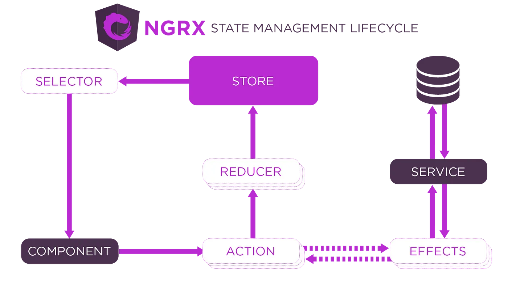

https://www.youtube.com/watch?v=a3_GW3RBqn0

https://medium.com/@igorm573/state-management-with-ngrx-in-angular-66ddc61cdf14



# Core Concepts of NgRx

## 1:Store (Single Source of Truth)

- A **centralized JavaScript object** that holds the entire application state.
- Components **read** data from the store but **cannot modify it directly.**

## 2. Actions (Events)

- Plain JavaScript objects that describe **what happened** (e.g., LoadUsers, AddUser).
- They trigger state changes.

```ts
// Example Action
export const loadUsers = createAction('[Users] Load Users');
export const addUser = createAction('[Users] Add User', props<{ user: User }>());
```

## 3. Reducers (Pure Functions)

- **Pure functions** that take the **current state + action** and return a **new state**.
- They **never mutate** the existing state.

```ts
// Example Reducer
const userReducer = createReducer(
  initialState,
  on(loadUsers, (state) => ({ ...state, loading: true })),
  on(addUser, (state, { user }) => ({
    ...state,
    users: [...state.users, user]
  }))
);
```

## 4. Selectors (State Queries)

- **Memoized functions** that extract specific data from the store.
- Improve performance by avoiding unnecessary re-computations.

```ts
// Example Selector
export const selectAllUsers = createSelector(selectUserState, (state) => state.users);
```

## 5. Effects (Side Effects)

- Handle **async operations** (HTTP calls, timers, etc.) without breaking Redux principles.
- Listen for **actions**, perform side effects, and **dispatch new actions**.

```ts
// Example Effect
loadUsers$ = createEffect(() =>
  this.actions$.pipe(
    ofType(loadUsers),
    switchMap(() =>
      this.userService.getUsers().pipe(
        map((users) => loadUsersSuccess({ users })),
        catchError((error) => of(loadUsersFailure({ error })))
      )
    )
  )
);
```
