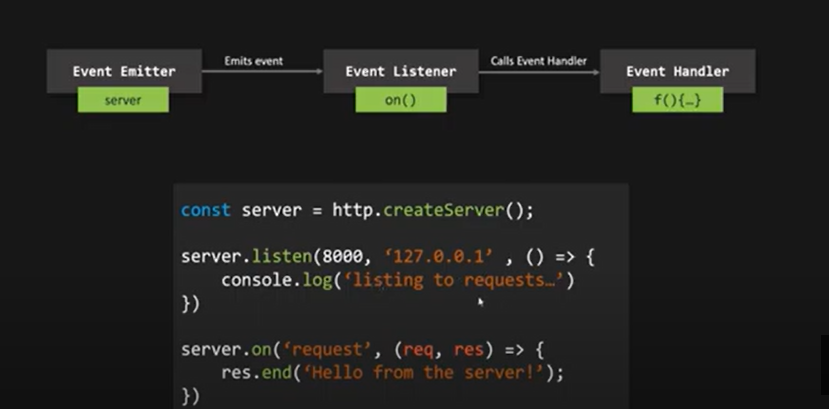

#### What is Node.js ?

#### What is nodejs and how it works ? - `completed`

#### What is module ?

#### What is middleware ?

#### How does Node.js handle concurrency even after being single-threaded?

#### What is jwt ? - `completed`

#### Differentiate between process.nextTick() and setImmediate()?

#### How would you use a URL module in Node.js?

#### What is express.js package ?

#### What are streams in Node.js?

#### What is REPL in Node.js?

#### What is the control flow function?

---

#### What is an EventEmitter in Node.js?

#### What is the role and usages of nodejs ?

#### Why you should use nodeJs ?

#### How the web works(Refresher) ?

#### What is difference between res.send and res.json ?

#### What is parser

#### What is env file and what it's used

#### what is cluster in mongodb ?

#### what is mongoose

#### What is difference between SQL and NOSQL ?

#### What is horix=zontal scrolling and vertical scrolling

#### What is mongoose ?

Ans: mongoose a object document mapping library

- What is Node.js, and how does it differ from traditional server-side technologies like Apache ?
  Ans: Nodejs is a open source, cross-platform runtime environment that runs outside of the browser.
- Explain the event-driven, non-blocking I/O model in Node.js.
  Ans:
  Event driven helps to perform non-blocking I/O model, in event driven architecture have event loop which basically which basically check pending event and executes their associated event handler. In event driven architecture there are three main player `Event Emitter`, `Event Listener`, `Event Hanlder`.

  

  ```js
  const http = requipre('http');
  const app = http.createServer();

  app.listen(3000);
  app.on('request', (req, res) => {});
  ```

- How do you install Node.js on your system ?
  Ans: Install nodejs
- What is npm, and what is its purpose in the Node.js ecosystem ?
- What is the package.json file in Node.js, and what is its significance ?
- dependency and devdependencies
- How can you create a simple HTTP server in Node.js? - `completed`

```js
const http = require('http');

http
  .createServer((req, res) => {
    res.setHeader('Content-Type', 'text/html');
    res.writeHead(200);
    res.end(`<html><body><h1>This is HTML</h1></body></html>`);
  })
  .listen(3000);
```

- HTTP Methods - `completed`
  `GET`, `POST`,`PUT`,`DELETE`

  ```js
  const productRouter = require('PATH_OF_PRODUCT_ROUTER');

  const express = require('express');
  const app = express();

  app.use('/api/product', productRouter);
  app.listen(3000, (req, res) => {});
  // Product Router
  const express = require('express');
  const router = express.Router();

  router.get('/', (req, res, next) => {
    res.json({ data: {} });
  });
  ```

- What is a callback function, and how is it commonly used in Node.js ?
- What is the purpose of the 'require' function in Node.js?
  Ans: `require` is used to import the file.
- Explain the concept of the `Event Loop` in Node.js.
  Ans: `Event loop` allow nodeJs to perform non-blocking I/O operation.
- What are the core modules in Node.js, and how are they different from external modules ?
  Ans: `fs`, `os`, `path`, `http`, `https`.
- What are Promises in Node.js, and how do they differ from callbacks ? - `completed`
- Describe the role of the `module.exports` object in Node.js.
  Ans: The `module.exports` is actually a property of the module object in node.js.By `module.exports`, we can export functions, objects, and their references from one file and can use them in other files by importing them by require() method.`model.exports` is use to achive modular programming.
- How can you handle errors in Node.js applications ?
  Ans: `try catch block`, `callbacks`, `promise then catch block`, `async await`.
- What is the purpose of the `util` module in Node.js ?

- Explain what `middleware` is in the context of Node.js and Express.js.
  Ans: `Middleware` is a request handler that allows to intercept and manipulate requests and responses before they reach route handlers.
  ```js
  app.get(path, (req, res, next) => {});
  // (req, res, next) => {} is middleware function
  ```
- How do you handle file I/O operations in Node.js ?
  Ans: https://www.geeksforgeeks.org/file-handling-in-node-js/
- What is the purpose of the 'fs' module in Node.js ?
  Ans: The Node.js file system module allows to work with the file system on your computer.
  https://www.w3schools.com/nodejs/nodejs_filesystem.asp
  Syantax:

  ```js
  var fs = require('fs');
  ```

- How do you create and use child processes in Node.js ?
- What is the purpose of the 'Buffer' class in Node.js ?
  Ans: The Buffer class in Node.js is used to perform operations on raw binary data.

  - Buffer.alloc(size): It creates a buffer and allocates size to it.
  - Buffer.from(initialization) - It initializes the buffer with given data.
  - Buffer.write(data) - It writes the data on the buffer.
  - toString() - It read data from the buffer and returned it.
  - Buffer.isBuffer(object) - It checks whether the object is a buffer or not.
  - Buffer.length - It returns the length of the buffer.
  - Buffer.copy(buffer,subsection size) - It copies data from one buffer to another.
  - Buffer.slice(start, end=buffer.length) - It returns the subsection of data stored in a buffer.
  - Buffer.concat([buffer,buffer]) - It concatenates two buffers.

- How can you implement streaming in Node.js ?
- Explain the concept of global objects in Node.js.
- What is the role of the 'os' module in Node.js?
  Ans: The `OS module` in NodeJS provides various utilities related to the operating system. It allows you to retrieve information about the current operating system, network interfaces, system uptime, and more.

  ```js
    const os = require('os');
    console.log('Platform:', os.platform());
    console.log('Architecture:', os.arch());
    console.log('Hostname:', os.hostname());
    console.log('Total Memory:', os.totalmem() / (1024 _ 1024), 'MB');
    console.log('Free Memory:', os.freemem() / (1024 _ 1024), 'MB');
    console.log('CPUs:', os.cpus().length);
    console.log('Network Interfaces:', os.networkInterfaces());
    console.log('Uptime:', os.uptime(), 'seconds');
  ```

- How can you perform unit testing in Node.js applications ?
- What is the purpose of the 'cluster' module in Node.js, and how does it help with scalability ?
  Ans: The Node.js cluster module is a built-in module that allows you to create a cluster of child processes. Each child process runs on a separate core of the CPU.
- What are some popular web frameworks for Node.js, and what are their differences ?
  Ans: `express`, `nest`
- How can you secure a Node.js application, and what are common security best practices ?
- What is npm's role in managing project dependencies and version control ?
- Describe the differences between 'setImmediate', 'setTimeout', and 'process.nextTick'.
  Ans:
  - `setImmediate()` is used to schedule a function to be executed after the current event loop iteration completes. It has a lower priority than I/O events, but a higher priority than setTimeout().
  - `setTimeout()` is used to schedule a function to be executed after a specified delay, measured in milliseconds. It does not guarantee that the function will be executed at the exact time specified, but only after the specified minimum delay.
  - `process.nextTick()` is used to schedule a function to be executed immediately after the current function completes. It is typically used to ensure that a callback function is executed before any other I/O events in the event loop.
  ```js
  console.log('Start');
  process.nextTick(() => {
    console.log('Inside process.nextTick');
  });
  setImmediate(() => {
    console.log('Inside setImmediate');
  });
  console.log('End');
  ```
- How can you debug a Node.js application ?
  Ans: yes run the application in debug mode and put the break point.
- Explain the concept of a RESTful API, and how can you create one using Node.js and Express.js?
- What is GraphQL, and how can you use it with Node.js ?
- What is the role of the 'WebSocket' protocol, and how can you implement real-time communication in Node.js?
  Ans: websocket is a bidirectional. it keeps the communication alive between client and server.

  ```js
  // npm install ws
  // server.js
  const WebSocket = require('ws');
  const server = new WebSocket.Server({ port: 8080 });

  server.on('connection', (ws) => {
    console.log('New client connected');

    ws.on('message', (message) => {
      console.log(`Received message: ${message}`);
      ws.send(`Server received: ${message}`);
    });

    ws.on('close', () => {
      console.log('Client disconnected');
    });

    ws.send('Welcome to the WebSocket server!');
  });

  console.log('WebSocket server is running on ws://localhost:8080');
  ```

- How can you deploy a Node.js application to a production server ?
- What is load balancing, and how can you implement it for Node.js applications?
- Can you explain the concept of microservices architecture in the context of Node.js?
- Stateless and statefull API

```

```

-- mongo --

- What is MongoDB ?
  Ans: MongoDB is document database which store data in JSON format
- How does MongoDB differ from traditional relational databases?
- Differentiate between MongoDB and SQL databases.
- What are the advantages and disadvantages of using MongoDB ?
  -Explain the concept of projection in MongoDB queries.
  -Indexing important in MongoDB?
  -How do you create an index in MongoDB?
  -What is the default index type in MongoDB?
  -Explain the purpose of the \_id field and its indexing.
  -How can you drop an index in MongoDB?
  -How do you handle relationships between documents in MongoDB?
  -When would you use embedding vs. referencing in MongoDB
  -What is the MongoDB Aggregation Framework?
  -Explain the $match and $group stages in the Aggregation Framework.
  -How do you unwind an array in MongoDB Aggregation?
  -What is the purpose of the $project stage?
  -What is sharding in MongoDB?
  -Explain the sharding key.
  -How does MongoDB distribute data in a sharded cluster?
  -Does MongoDB support transactions?
  -Explain the difference between multi-document transactions and single-document transactions in MongoDB.
  -Does MongoDB support transactions?
  -Explain the difference between multi-document transactions and single-document transactions in MongoDB.

```

```
