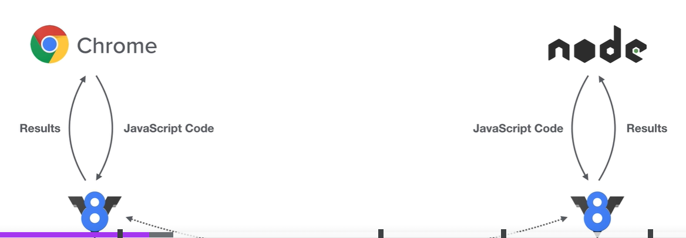
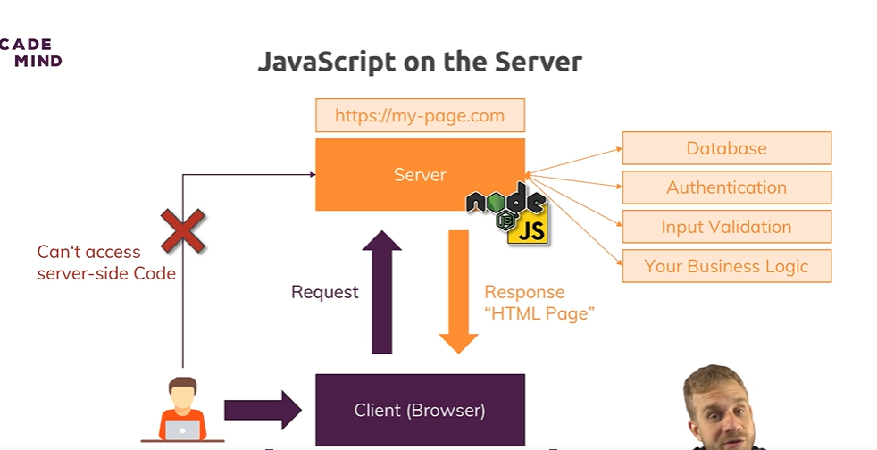
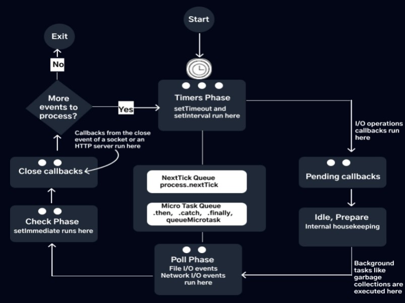

#### What is nodeJs ?

Nodejs is an opensource javaScript runtime environment that running web application outside the client browser.It uses for server side web application.
Node.js is a js runtime environment that allows JavaScript to be executed on the server side. It is built on the V8 JavaScript engine from Chrome, which compiles JavaScript into efficient machine code, and V8 engine is written in c++


JS Environment of nodejs have not the same property which browser provides it has similar kind of.

- In node we have global instead of window
- In node we have process instead of document



#### How thw web works ?

Ans:


#### What is module in nodejs ?

Ans: Module is a file or collection of file that exports function object, value that can be used in another files.

#### What is middleware in nodejs ?

Ans: middleware is a function that executes during request and response cycle.

- Middleware functions are functions that have access to the request (req), response (res), and the next middleware function in the application’s request-response cycle.
- They are used to handle tasks such as logging, authentication, validation, error handling, and more.
- Middleware can modify the req and res objects, or end the request-response cycle.

`Types of Middleware:`

- Application-Level Middleware: Applied to specific routes or the entire application.
- Router-Level Middleware: Applied to specific routers or route handlers.
- Built-In Middleware: Middleware that comes with Express, such as express.json() and express.static().
- Third-Party Middleware: Middleware from npm packages, such as body-parser, cors, and morgan.

#### What are core modules of nodejs?

Ans: http, https, fs, path, os

#### How does Node.js handle concurrency even after being single-threaded?

Ans:

#### What is jwt ?

Ans: jwt stands for json web token, it is use for securely transmitting transition between two parties.

`Structure of JWT`

- Header
- payload
- signature

#### Differentiate between process.nextTick() and setImmediate()?

Ans: `process.nextTick()` and `setImmediate()` both are used to handle the asynchronous call.

- `process.nextTick()`: it runs after the callstack got empty and before the event loop operation, means before any I/O operation runs the callback function.

- `setImmediate()`: It runs after the event loop, means that callback is executed after the I/O operation

#### What is an EventEmitter in Node.js?

Ans: `EventEmmiter` is a core class from `event` modules that handles the event driven programming model. it allow to object to emit the events and allow other part of the code to listen those event.

```js
const EventEmitter = require('event');
const myEmitter = new EventEmitter();

myEmitter.on('dataReceived', (data) => {
  console.log('Data received:', data);
});
/**
 * Here, dataReceived is the name of the event, and the function you provide is the listener that will be executed when this event is emitted.
 * /
```

#### How would you use a URL module in Node.js?

Ans: url modules provides utilities for url parsing and resolution.

`url parsing`: url parsing break down url to mulitple components. so that we can access that component seperately.

- `Protocol`: The scheme used to access the resource, such as http, https, ftp, etc.
- `Hostname`: The domain name or IP address where the resource is hosted, e.g., example.com.
- `Port`: The port number used to connect to the resource, e.g., 8080. It is optional and often omitted.
- `Path`: The specific path to the resource on the server, e.g., /path/to/resource.
- `Query`: The query string used to pass parameters to the resource, e.g., ?key=value.
- `Fragment`: The fragment identifier used to refer to a specific section within the resource, e.g., #section.

`resolution`: URL resolution is the process of converting a relative URL into an absolute URL by combining it with a base URL.

```js
const url = require('url');

const baseUrl = 'https://example.com/path/';
const relativeUrl = 'subpath/resource.html';

const resolvedUrl = url.resolve(baseUrl, relativeUrl);

console.log(resolvedUrl); // https://example.com/path/subpath/resource.html
```

#### What is express.js package ?

Ans: express.js is a popular framework for nodejs and it siplifies the process of building web server and api by providing a set of feature to handle the http request, routing, middleware and more.

#### What are streams in Node.js?

Ans: stream is powerful to handle the data, particularly when dealing with large amounts or continous data source. stream provides to prcess data piece by piece rather that loading at all in memory at once.

`Types of streams in nodejs`

- `Readble stream`: To read data from a source, such as a file or an HTTP request.

```js
const fs = require('fs');

const readableStream = fs.createReadStream('example.txt');

readableStream.on('data', (chunk) => {
  console.log('Received chunk:', chunk.toString());
});

readableStream.on('end', () => {
  console.log('No more data.');
});
```

- Writable stream: To write data to a destination, such as a file or an HTTP response.

```js
const fs = require('fs');

const writableStream = fs.createWriteStream('output.txt');

writableStream.write('Hello, world!\n');
writableStream.write('Another line.\n');
writableStream.end('End of file.');
```

- Duplex stream: To handle both reading and writing of data.

```js
const fs = require('fs');

const readableStream = fs.createReadStream('example.txt');
const writableStream = fs.createWriteStream('output.txt');

readableStream.pipe(writableStream);
```

- Transform stream: To modify or transform data as it is being read or written.

```js

```

#### What is REPL in Node.js?

Ans: REPL stands for Read-Eval-Print Loop and is useful for quick experimentation, debugging, and testing small snippets of code.

- `Read:` The REPL reads a line of input from the user.
- `Eval:` It evaluates the input as JavaScript code.
- `Print:` It prints the result of the evaluation.
- `Loop:` It repeats the process, waiting for the next line of input.

#### What is the control flow function?

Ans: control flow is a function which manage the order in which asynchronous operation are executed.

Control flow function in Nodejs

- Callbacks
- Promises
- Async/await

#### How Node.js Event loop Works ?

https://www.freecodecamp.org/news/a-guide-to-the-node-js-event-loop/
Ans: The Node.js event loop has six phases

- Timer phase
- Pending Callbacks Phase
- Idle Phase
- Poll Phase
- Check Phase
- Close Callbacks Phase



`Timer Phase`: There are three timers in Node.js: setTimeout, setInterval, and setImmediate. setTimeout and setInterval run in the timer phase. The code sample below runs during the timer phase:

```js
setTimeout(() => {
  console.log('setTimeout callback executed');
}, 1000);

setInterval(() => {
  console.log('setInterval callback executed');
}, 2000);
```

`Pending Callbacks Phase`: I/O operations execute in the poll phase of the event loop. During the poll phase, some specific I/O operations callbacks defer to the pending phase of the next iteration of the event loop. I/O operations callbacks deferred from the previous iteration run in the pending callbacks phase.

The code sample below runs during the ‘pending callbacks’ phase:

```js
const fs = require('fs');

fs.readFile(__filename, (err, data) => {
  if (err) throw err;
  console.log('File data:', data);
});
```

`Idle Phase`: The idle phase is not a normal phase of the Node.js event loop. It is a period whereby the event loop has nothing to do but perform background tasks like checking for low-priority results or running garbage collection.

```js
const { idle } = require('idle-gc');

idle.ignore();
```

`Poll Phase`: The poll phase is where I/O operations execute. I/O operations transfer data to or from a computer. The event loop checks for new I/O operations and executes them in the poll queue.

```js
const http = require('http');

http.get('http://jsonplaceholder.typicode.com/posts/1', (res) => {
  console.log('HTTP request response received');
  res.on('data', (chunk) => {
    // Do something with the data
  });
});
```

`Check Phase`: The check phase is where the setImmediate timer runs. The Node.js event loop goes to the check phase when there is a setImmediate in the program, and the poll phase becomes idle or when the poll phase completes.

```js
setImmediate(() => {
  console.log('setImmediate callback executed');
});
```

`Close Callbacks Phase`: The close callbacks phase is the last phase of the Node.js event loop. The close callback phase is where callbacks from the close event of a socket and the closing of an HTTP server run.

```js
const http = require('http');

const server = http.createServer((req, res) => {
  res.writeHead(200, { 'Content-Type': 'text/plain' });
  res.end('Hello World\n');
});

server.listen(3000, () => {
  console.log('Server listening on port 3000');
  server.close(() => {
    console.log('Server closed');
  });
});
```

#### Write allow us to write the data to the response

```js
const server = http.createServer((req, res) => {
  console.log(req.url, req.headers, req.method);
  res.setHeader('Content-Type', 'text/html');
  res.write('<html>');
  res.write('<head><title>my first app</title></head>');
  res.write('<body><h1>my first app</h1></body>');
  res.write('</html>');
  return res.end();
});

server.listen(3000);
```

#### What is stream and buffer in node.js ?

`Stream`: A stream is a sequence of data elements made available over time. It's a way to handle input or output operations.where data is read from or written to a source (like a file, network connection, or even memory).

Example: Reading a data from file
`fs.createReadStream`

`Buffers`: A buffer is a temporary storage area, usually in memory, used to hold data is being processed by streams.

```js
const body = [];
readStream.on('data', (chunk) => {
  body.push(chunk);
});
readStream.on('end', () => {
  console.log('contet of buffer', Buffer.concat(body).toString());
});
```

#### What is event driven programming in nodejs ?

Ans: The event-driven model allows developers to write non-blocking, asynchronous code that responds to events as they occur, without waiting for blocking operations to complete.

`Events and Event Emitters`

- `Events`: Events are signals indicating that a particular action or state change has occurred. In Node.js, events are represented by strings (event names) and associated data (event payloads).

- `Event Emitters`: An event emitter is an object capable of emitting events. It provides methods to register event listeners (callbacks) for specific events and trigger those listeners when the corresponding events occur.

#### Nodejs Looking behind the scene - 38 not clear

#### What is expressJs

Ans: ExpressJs is a nodeJs framework a package that adds bunch of utility functions and tools and clear set of rules on how the app should be built(middleware).

It's a highly extensible and other package can be plugged into it(middleware)

- Express js is highly depend on middleware function - we can easily add them by calling use.
- middleware function handle a request and should call `next()` to forward the request to next function inline(top-to-bottom) or send a response.

#### What is use() in expressJs?

Ans: It is mostly used to set up middleware in our application. , it take the callback function which have request, response, next.

`Synatax`: app.use(path, callback)

Parameter:

- `path:` It is the path for which the middleware function is being called. It can be a string representing a path or path pattern or a regular expression pattern to match the paths.
- `callback:` It is a middleware function or a series/array of middleware functions.

```js
const express = require('express');
const app = express();

app.use(function (req, res, next) {
  console.log('Middleware called');
  next();
});

// Requests will reach this route after
// passing through the middleware
app.get('/user', function (req, res) {
  console.log('/user request called');
  res.send('Welcome');
});
```

#### What are Middleware Functions?

Ans: Middleware functions in Express are functions that have access to the request object (req), the response object (res), and the next middleware function in the application’s request-response cycle. These functions can perform a variety of tasks, such as executing code, modifying the request and response objects, ending the request-response cycle, and calling the next middleware in the stack.

` next()`: The next( ) function is a callback that, when invoked, passes control to the next middleware function.This is essential in ensuring that the subsequent middleware or route handlers are executed.

```js
app.use((req, res, next) => {
  console.log('In the middleware !');
  next();
});

app.use((req, res, next) => {
  console.log('In the another middleware !');
});
/*
    In the middleware !
    In the another middleware !
*/
`Note`: if will not pass the next() the output will be 'In the middleware !'
```

#### What is Body-parser Middleware in Node.js

Ans: It is responsible for parsing the incoming request from client to the server. for parsing the data stream express provide the middleware function.

like for example parsing json object

```js
app.use(express.json());
```

#### What is `__dirname` ?

Ans: `__dirname` is an environment variable that tells you the absolute path of the directory containing the currently executing file.

#### What is static middleware method in express ?

#### What is templating engine ?

#### What is app.set

Ans: Sharing data across application it comes from express

```js
app.set('title', 'My Site');
app.get('title'); // My Site
```

#### What is MVC pattern ?

`Model`:

- responsible for representing data
- responsible for managin data(fetching, savinng, etc)
- Doesn't matter if you manage data in memory or database
- Contains data related logic

`View`:

- What the user see
- should contain too much logic

`controler`:

- Connects the modela and view
- Should only make sure that two can communicate (in both direction)

#### what is mongoose ?

Ans: it's model design scema, it's help to communicate with mongoDb data base.
