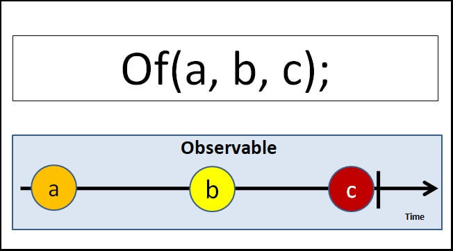

### What is a data stream?

A `data stream` is the data that arrives over some time. The stream of data can be anything. Like variables, user inputs, properties, caches, data structures, and even failures, etc

At any point in time, the stream may emit the following three things.

- `Value`: i.e., the next value in the stream
- `Complete`: The stream has ended
- `Error`: The error has stopped the stream.

### Reactive Programming

`Reactive programming` is about creating the stream, emitting value, error, or complete signals, manipulating, transferring, or doing something useful with the data streams.

### What is RxJS

The RxJS (Reactive Extensions Library for JavaScript) is a Javascript library that allows us to work with asynchronous data streams.

The RxJs has two main players

- Observable
- Observers ( Subscribers)

### What is an Observable in Angular

Observable is a function that converts the `ordinary data stream(ordinary data stream typically refers to a sequence of data elements that are transmitted or processed sequentially)` into an observable one.You can think of Observable as a wrapper around the ordinary data stream.

An observable stream or simple Observable emits the value from the stream asynchronously. It emits the complete signals when the stream completes or an error signal if the stream errors out.

The observable starts to emit values only when `someone subscribes to it.`

### What is `observers` (subscribers)

The `observers` communicate with the `Observable` using `callbacks`.

The observer must subscribe to the observable to receive the value from the observable. While subscribing, it optionally passes the three callbacks. `next()`, `error()` & `complete()`.

The observable invokes the `next()` callback whenever the `value arrives` in the stream. It passes the value as the argument to the next callback. If the error occurs, then the `error()` callback is invoked. It invokes the `complete()` callback when the stream completes.

```
 src = new Observable((observer) => {
    observer.next(1),
      observer.next(2),
      observer.next(3),
      observer.next(4),
      observer.next(5),
      // observer.error('Error Emitted'),
      observer.complete(),
      observer.next(6); // This will not emit
  });
  obs$!: Subscription;

  ngOnInit(): void {
    this.obs$ = this.src.subscribe({
      next: (res) => {
        console.log('Data Stream value', res);
      },
      error: (err) => {
        console.log('Error Occured');
      },
      complete: () => {
        console.log('Observable Completed');
      }
    });
  }
```

### Create observable from a string, array & object in angular

- `Of Operator`: Of creates the observable from the arguments that we pass into it.we can pass any number of arguments. Each argument emitted separately and one after the other. It sends the `Complete` signal in the end.



```
ngOnInit() {
  const array=[1,2,3,4,5,6,7]
  const obsof1=of(array);
  obsof1.subscribe({
      next: (res) => {
        console.log('Data Stream value', res);
      },
      error: (err) => {
        console.log('Error Occured');
      },
      complete: () => {
        console.log('Observable Completed');
      }
    })
}

**** Output ***
Data Stream value [1, 2, 3, 4, 5, 6, 7]
Observable Completed
```

- `From Operator`: From Operator takes only one argument that can be iterated and converts it into an observable.

```
ngOnInit() {
  const array=[1,2,3,4,5,6,7]
  const obsfrom2=of(array);
  obsfrom2.subscribe({
      next: (res) => {
        console.log('Data Stream value', res);
      },
      error: (err) => {
        console.log('Error Occured');
      },
      complete: () => {
        console.log('Observable Completed');
      }
    })
}

**** Output ***
Data Stream value 1
Data Stream value 2
Data Stream value 3
Data Stream value 4
Data Stream value 5
Data Stream value 6
Data Stream value 7
Observable Completed
```

### Of Vs From

| Of                                                     | from                                            |
| ------------------------------------------------------ | ----------------------------------------------- |
| Accepts variable no of arguments                       | Accepts only one argument                       |
| emits each argument as it is without changing anything | iterates over the argument and emits each value |

### Create Observable from Event

FromEvent method to create an `observable` from `DOM events directly`.

Syntax:

```
fromEvent<T>(target: FromEventTarget<T>,
             eventName: string,
             options: EventListenerOptions,
             resultSelector: (...args: any[]) => T): Observable<T>
```

FromEventTarget is the first argument to `fromevent`. It can be a DOM EventTarget, Node.js EventEmitter, JQuery-like event target, NodeList or HTMLCollection. The target must have a method to register/unregister the event handler. (`addEventListener`/ `removeEventListener` in case of DOM Event target)

eventName is the second argument, which is a type of event we want to listen to.

Options are the additional argument that we want to pass to , when registering the event handler i.e `addEventListener`

```
<button #btn>Button</button>

@ViewChild('btn', { static: true }) button: ElementRef;

ngAfterViewInit() {
    this.buttonClick();
}

buttonClick() {
    this.buttonSubscription =  fromEvent(this.button.nativeElement, 'click')
        .subscribe(res => console.log(res));
}
```

### Pipe Operator

Pipe is used to `chain` multiple operators together.The pipe method accepts operators as `arguments`. Each argument must be separated by a `comma`. The order of the operators is important because when a user subscribes to an observable, the pipe executes the operators in a sequence in which they are added.

There are two ways we can use the pipe.

- As an instance of observable
- As standalone method

`As an instance of observable`:

```
src = new Observable((observer) => {
    observer.next(1),
      observer.next(2),
      observer.next(3),
      observer.next(4),
      observer.next(5),
      observer.complete(),
  }).pipe(
    filter((data: any) => data > 2),
    map((value) => value * 2)
  );

// Note: first operator value will passed to next operator

ngOnInit(): void {
    this.src.subscribe({
      next: (res) => {
        console.log('Data Stream value', res);
      },
      error: (err) => {
        console.log('Error Occured');
      },
      complete: () => {
        console.log('Observable Completed');
      }
    });
  }

  -----Output-----
  Data Stream value 6
  Data Stream value 8
  Data Stream value 10
```

`As standalone method`:

```
 customOperator = pipe(
    // tap((item: any) => console.log(item)),
    filter((data: any) => data > 2),
    map((value) => value * 2)
  );

src = new Observable((observer) => {
observer.next(1),
    observer.next(2),
    observer.next(3),
    observer.next(4),
    observer.next(5),
    observer.complete(),
    observer.next(6);
}).pipe(this.customOperator);
```

### Map Operator

Map operator takes an observable source as input. It applies a project function to each of the values emitted by the source observable and transforms them into a new value.

Syantax:

map<T, R>(project: (value: T, index: number) => R, thisArg?: any): OperatorFunction<T, R>

```
srcArray = from([1, 2, 3, 4]);

 multiplyBy2() {
    this.srcArray
    .pipe(map(val => { return val * 2}))
    .subscribe(val => { console.log(val)})
  }

  --- output ---
  2
  4
  6
  8
```

### filter operator

`filter` operator filters the items emitted by the source Observable using a `condition`. It emits only those values that `satisfy the condition` and ignores the rest.

Syntax:

filter<T>(predicate: (value: T, index: number) => boolean, thisArg?: any): MonoTypeOperatorFunction<T>

```
ngOnInit() {
of(1, 2, 3, 4, 5, 6, 7, 8, 9, 10)
    .pipe(
    filter((val) => {
        return val % 2 == 0;
    })
    )
    .subscribe({
    next: (val) => console.log(val),
    });
  }
---output---
2
4
6
8
10
```

### tap operator

tap operator returns an observable identical to the source. It does not modify the stream.The tap operator is useful for logging the value,

Syntax:

tap(nextOrObserver: function, error: function, complete: function): Observable

```
fromObservable = from([1, 2, 3]).pipe(
    tap({
      next: (value) => console.log('before', value),
      error: (err) => console.log(err),
      complete: () => {}
    }),
    map((item: number) => {
      return item * 2;
    }),
    tap({
      next: (value) => console.log('after', value),
      error: (err) => console.log(err),
      complete: () => {}
    })
  );

 --- output ---
 before 1
 after 2
 before 2
 after 4
 before 3
 after 6
```

### SwitchMap

The SwitchMap maps each value from the source observable into an inner observable, subscribes to it, and then starts emitting the values from it. It creates a new inner observable for every value it receives from the Source. Whenever it creates a new inner observable it unsubscribes from all the previously created inner observables.

`Syntax`:

```
switchMap(project: (value: T, index: number) => O): OperatorFunction<T, ObservedValueOf<O>>

```

`project`: is a function that we use to manipulate the values emitted by the source observable.The project can accept two arguments. one is value i.e. the value emitted by the source observable. The second argument is index number.

Note: `The project function must return an observable`.

`Example1:`

```
srcObservable = of(1, 2, 3, 4);
innerObservable = of('A', 'B', 'C', 'D');

this.srcObservable
    .pipe(
    switchMap((value) => {
        console.log('Src Value', value);
        console.log('new observable start');
        return this.innerObservable;
    })
    )
    .subscribe({
    next: (innerValue) => {
        console.log(innerValue);
    }
});
```

`Example2:`

```
 fromEventHandler() {
    this.buttonSubscription$ = fromEvent(this.button.nativeElement, 'click')
      .pipe(
        debounceTime(500),
        switchMap(() => of(1, 2, 3))
      )
      .subscribe({
        next: (res) => {
          console.log(res);
        }
      });
  }
```

`useCase`: Autocomplete Search Feature

### MergeMap

The MergeMap maps each value from the source observable into an inner observable, subscribes to it, and then starts emitting the values from it replacing the original value. It creates a new inner observable for every value it receives from the Source.

Unlike SwitchMap, MergeMap does not cancel any of its inner observables. It merges the values from all of its inner observables and emits the values back into the stream.

`Syantax`: mergeMap(project: (value: T, index: number) => O): OperatorFunction<T, ObservedValueOf<O>>

`useCase`: Consider a scenario where to receive data from an observable (outer observable). For each of those values, we want to call another observable (inner observable) to get more data. The scenario like this is an ideal use case for MergeMap

Example 1:

```
of("hound", "mastiff", "retriever")        //outer observable
  .pipe(
    mergeMap(breed => {
      const url = 'https://dog.ceo/api/breed/' + breed + '/list';
      return this.http.get<any>(url)       //inner observable
    })
  )
  .subscribe(data => {
    console.log(data)
  })
```

Example 2:

```
 delayedObs(count: number) {
    return new Observable((observer) => {
      setTimeout(() => {
        observer.next(count + ' A');
      }, 1000);
      setTimeout(() => {
        observer.next(count + ' B');
      }, 2000);
      setTimeout(() => {
        observer.next(count + ' C');
        observer.complete();
      }, 3000);
    });
  }

  mergeMapExample() {
    this.srcObservable
      .pipe(
        mergeMap(() => {
          this.count = this.count + 1;
          return this.delayedObs(this.count);
        })
      )
      .subscribe((val) => console.log(val));
  }

  ---output ---
    1 A
    2 A
    3 A
    1 B
    2 B
    3 B
    1 C
    2 C
    3 C
```

### Using ForkJoin with MergeMap

The MergeMap create a one inner observable for each value of outer observable. To Create more than one inner observable, we can make use of the ForkJoin Operator.

Example:

```
function fetchShipmentData(shipmentId: number): Observable<any> {
  return ShipmentService.getShipmentDetails(shipmentId).pipe(
    mergeMap((shipmentDetails: any) => {
      // Use forkJoin to fetch customer details and shipment status concurrently
      return forkJoin({
        shipment: of(shipmentDetails),
        customer: CustomerService.getCustomerDetails(shipmentDetails.customerId),
        status: StatusService.getShipmentStatus(shipmentDetails.statusId)
      });
    })
  );
}
```

### ConcatMap

The ConcatMap maps each value from the source observable into an inner observable, subscribes to it, and then starts emitting the values from it replacing the original value. It creates a new inner observable for every value it receives from the Source.

It merges the values from all of its inner observables `in the order in which they are subscribed` and emits the values back into the stream.

It is Similar to `MergeMap` except for one difference that it `maintains the order` of its inner observables.

`Syntax:`
concatMap(project: (value: T, index: number) => O): OperatorFunction<T, ObservedValueOf<O>>

Example

```
 delayedObs(count: number) {
    return new Observable((observer) => {
      setTimeout(() => {
        observer.next(count + ' A');
      }, 1000);
      setTimeout(() => {
        observer.next(count + ' B');
      }, 2000);
      setTimeout(() => {
        observer.next(count + ' C');
        observer.complete();
      }, 3000);
    });
  }

  mergeMapExample() {
    this.srcObservable
      .pipe(
        concatMap(() => {
          this.count = this.count + 1;
          return this.delayedObs(this.count);
        })
      )
      .subscribe((val) => console.log(val));
  }

  ---output ---
    1 A
    1 B
    1 C
    2 A
    2 B
    2 C
    3 A
    3 B
    3 C
```

### ExhaustMap

The Angular ExhaustMap maps each value from the source observable into an inner observable, subscribes to it. It then starts emitting the values from it replacing the original value. It then waits for the inner observable to finish. If it receives any new values before the completion of the inner observable it ignores it.

```
 delayedObs(count: number) {
    return new Observable((observer) => {
      setTimeout(() => {
        observer.next(count + ' A');
      }, 1000);
      setTimeout(() => {
        observer.next(count + ' B');
      }, 2000);
      setTimeout(() => {
        observer.next(count + ' C');
        observer.complete();
      }, 3000);
    });
  }

  mergeMapExample() {
    this.srcObservable
      .pipe(
        exhaustMap(() => {
          this.count = this.count + 1;
          return this.delayedObs(this.count);
        })
      )
      .subscribe((val) => console.log(val));
  }

  ---output---
  1 A
  1 B
  1 C
```

### Take, TakeUntil, TakeWhile & TakeLast

- `Take`: The take operator in RxJS is used to limit the number of emissions from an observable stream. It emits only the first n values emitted by the source observable and then completes, ignoring any subsequent values.

`Syntax:` take(n)

- Where n is the maximum number of values to emit.
- If the source emits more than n values, then take emits only n values and completes.
- If the source emits less than n number of values, then take emits all of them before completing.

```
  obs = of(1, 2, 3, 4, 5).pipe(take(2));

  ngOnInit() {
    this.obs.subscribe(val => console.log(val));
  }

  --output--
  1
  2
```

- `TakeUntil`: The `takeUntil` operator returns an Observable that emits value from the source Observable until the `notifier` Observable emits a value.

`Syntax`: TakeUntil(notifier: Observable): Observable

- We must pass a notifier observable as the argument to the TakeUntil Operator.
- TakeUntil emits the values from the Source Observable as long as it does not receive any value from the notifier observable.
- When the notifier emits a value, the TakeUntil completes the Source observable.
- If the notifier completes without emitting any value, then the TakeUntil keeps emitting values from the source and completes when the source completes.

```
<button (click)="stopObs()">Stop</button>

notifier = new Subject();

ngOninit() {
interval(1000)
  .pipe(take(5), takeUntil(this.notifier))
  .subscribe({
    next: (value) => {
      console.log('Value', value);
    }
  });
}

stopObs() {
  this.notifier.next(true)
  this.notifier.complete()
}

```

### TakeWhile

TakeWhile operator will keep emitting the value from the source observable as long as they pass the given condition (predicate). When it receives a value that does not satisfy the condition it completes the observable. No further values are emitted even if they satisfy the condition.

Syntax:

```
takeWhile(predicate: function(value, index): boolean,
inclusive?: boolean): Observable
```

- `predicate` is the condition.
- If `inclusive` is true, then the emits the value, which does not pass the condition before terminating the observable.

```
of(1, 2, 3, 4, 3, 2, 5)
  .pipe(takeWhile((val) => val < 3, true))
  .subscribe({
    next: (val) => {
      console.log('takeWhile Value', val);
    }
  });

--output--
1
2
3
```

If the second argument will be false then output will be only 1,2

### TakeLast

TakeLast operator emits the last n number of values from the source observable.

`Syntax`: takeLast<T>(n: number)

- Where `n` is the maximum number of values to emit.

- To know the last n number of values, the TakeLast needs to wait for the source to complete. Hence if the source never completes, then TakeLast will never emit a value.

- if the source emits less than the n number of values then it emits all of them

```
of(1, 2, 3)
  .pipe(takeLast(2))
  .subscribe({
    next: (val) => {
      console.log('takeLast Value', val);
    }
  });

  --output--
  2
  3
```
